# 数据结构基础知识点

> 说明：本文根据菜鸟教程（runoob.com）及华为云、阿里云开发者社区等公开学习资料，并结合极客时间专栏《重学数据结构与算法》（全文可参考 https://learn.lianglianglee.com/专栏/重学数据结构与算法-完 ）整理补充，供学习参考。代码示例以 Python / C 伪代码为主。
> 
> 文中结构示意图使用 **Mermaid** 绘制，在 GitHub、Typora 等支持 Mermaid 的 Markdown 编辑器中可直接渲染。

## 目录

- [一、数据结构是什么？](#一数据结构是什么)
- [二、数组](#二数组array)
- [三、栈](#三栈stack)
- [四、队列](#四队列queue)
- [五、哈希表](#五哈希表hash-table)
- [六、二叉树](#六二叉树binary-tree)
- [七、堆](#七堆heap)
- [八、递归](#八递归recursion)
- [九、经典排序算法](#九经典排序算法)
- [十、算法思维进阶：分治 · 动态规划 · 贪心](#十算法思维进阶分治-动态规划-贪心)
- [十一、常用数据结构复杂度速查表](#十一常用数据结构复杂度速查表)
- [十二、推荐学习资源与刷题清单](#十二推荐学习资源与刷题清单)

---

## 〇、学习主线：降低复杂度的方法论

课程开篇给出了一个贯穿始终的方法论：**面对任何性能问题，都按这三步走**。

1. **暴力解法**：在没有任何时间、空间约束下，先把功能做出来。
2. **无效操作处理**：剔除代码中的无效计算、无效存储（如把 O(n²) 的双层循环降为 O(n) 的扫描）。
3. **时空转换**：设计更合理的数据结构，用"空间换时间"（如用哈希表把查找从 O(n) 降到 O(1)）。

> 简单说：**先暴力 → 再砍无效 → 最后用数据结构换时间**。本文讲的数据结构，就是第三步的"武器库"。

---

## 一、数据结构是什么？

**数据结构**（Data Structure）是计算机存储、组织数据的方式，它研究的是"数据元素之间存在的相互关系"以及"如何在计算机中存储和操作这些数据"。

学习数据结构的核心目的：**选择合适的数据组织方式，让增删改查（CRUD）等操作更高效**。

### 1. 逻辑结构（数据元素之间的关系）

| 结构   | 特点                   | 典型例子         |
| ---- | -------------------- | ------------ |
| 集合   | 元素之间除了"同属一个集合"外无其他关系 | 哈希集合 HashSet |
| 线性结构 | 元素之间存在**一对一**的线性关系   | 数组、链表、栈、队列   |
| 树形结构 | 元素之间存在**一对多**的层次关系   | 二叉树、堆、B 树    |
| 图形结构 | 元素之间存在**多对多**的网状关系   | 图、社交网络       |

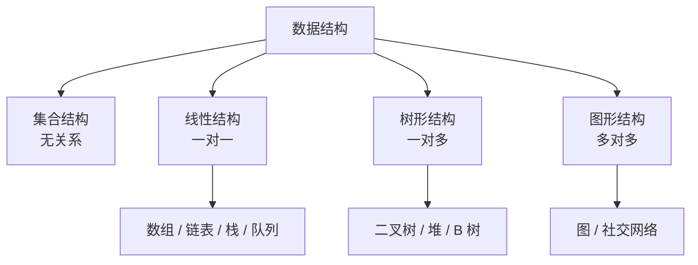

### 2. 物理存储结构

- **顺序存储**：用连续的内存单元存放，如数组。随机访问快（O(1)），但插入/删除需要移动元素。
- **链式存储**：用指针把分散的内存单元串联起来，如链表。插入/删除快，但无法随机访问。

### 3. 时间复杂度和空间复杂度

- **时间复杂度**：描述算法运行时间随数据规模 n 的增长趋势，常用大 O 表示，如 O(1)、O(log n)、O(n)、O(n²)。
- **空间复杂度**：描述算法运行时占用的额外内存随 n 的增长趋势。

> 记忆顺序：`O(1) < O(log n) < O(n) < O(n log n) < O(n²) < O(2ⁿ)`，越靠左越高效。

#### 3.1 大 O 记号的三个计算原则

1. **与常系数无关**：O(n) 和 O(2n) 等价——"顺序执行两遍 O(n) 的代码"仍是 O(n)。
2. **相加取高阶**：O(n²) + O(n) 等价于 O(n²)，因为 n 足够大时低阶项的影响可以忽略。
3. **O(1) 是特例**：表示资源消耗与输入规模 n 无关，比如"取数组第一个元素"，无论数组多大都只花固定时间。

#### 3.2 代码结构与时间复杂度的对应关系（经验法则）

| 代码结构           | 时间复杂度              |
| -------------- | ------------------ |
| 顺序结构（无循环）      | O(1)               |
| 二分查找 / 分而治之策略  | O(log n)           |
| 一个简单的 for 循环   | O(n)               |
| 两个顺序执行的 for 循环 | O(n) + O(n) = O(n) |
| 两个嵌套的 for 循环   | O(n²)              |

直观对比（n = 10 万条数据时）：

| 复杂度      | 计算次数     | 直观感受                  |
| -------- | -------- | --------------------- |
| O(n²)    | 约 100 亿次 | 大数据场景几乎不可用            |
| O(n)     | 10 万次    | 可接受                   |
| O(log n) | 约 17 次   | 极快（log₂100000 ≈ 16.6） |

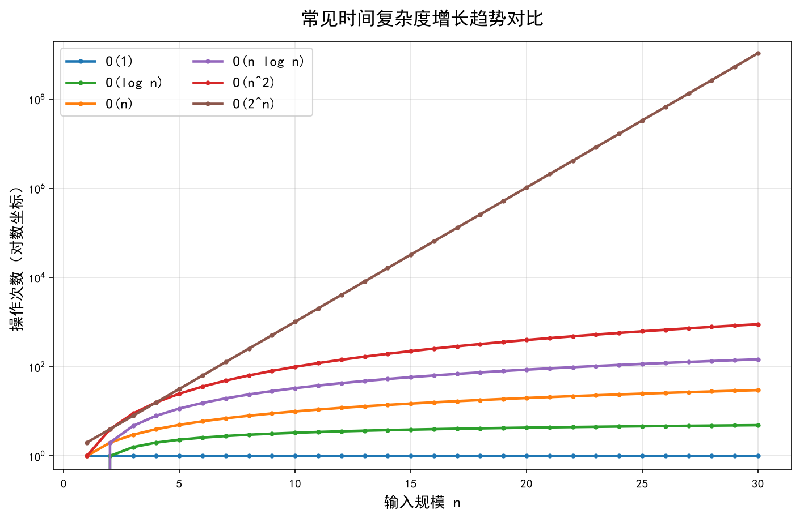

#### 3.3 最好、最坏与平均时间复杂度

同一个算法在不同输入下表现不同，因此复杂度要区分场景：

- **最好情况**：输入恰好最理想，如线性查找第一个元素就命中 → O(1)。
- **最坏情况**：输入恰好最糟糕，如线性查找最后一个元素才命中 → O(n)。
- **平均情况**：所有输入等概率出现时的期望值 → O(n/2)，即 O(n)。
- **均摊复杂度**：个别操作很贵，但均摊到连续操作上很便宜。典型例子：**动态数组扩容**。每次 append 是 O(1)，但当数组满了要扩容时需把 n 个元素复制到新数组（O(n)），把这次昂贵的复制"摊"到前面的 n 次 append 上，**均摊下来仍是 O(1)**。

> 面试常问：Python 的 `list` 为什么 append 是 O(1)？答案就是均摊分析——倍增扩容，摊还成本 O(1)。

#### 3.4 空间换时间（课程第二章的核心思想）

降低复杂度最常用的手段是**时空转换**：用额外的空间（哈希表、缓存、预处理结果）换取更低的运行时间。

**例子：找出数组中出现次数最多的元素。**

- 暴力法：双层循环统计每个元素出现次数，时间 O(n²)，空间 O(1)。
- 空间换时间：第一遍遍历把"元素 → 次数"存入哈希表（O(n)），第二遍遍历哈希表找最大值（O(n)），时间降为 **O(n)**，代价是空间升为 O(n)。

```Python
def most_frequent(nums):
    cnt = {}
    for x in nums:          # O(n) 建表
        cnt[x] = cnt.get(x, 0) + 1
    return max(cnt, key=cnt.get)   # O(n) 找最大值
```

> 结论：时间复杂度和**代码结构**高度相关，空间复杂度和**数据结构选择**高度相关。遇到性能瓶颈时，优先考虑"换个更合适的数据结构"。

---

## 二、数组（Array）

### 1. 定义

**数组**是把**相同类型**的元素按**连续内存地址**存放的线性表，通过**下标（索引）**访问元素。

- 随机访问按下标是 **O(1)**，这是数组最核心的优势。
- 为什么按下标访问是 O(1)？因为数组内存连续，可以直接用寻址公式算出地址，不需要遍历：

```
addr(i) = base_address + i × size   # size 为单个元素占用的字节数
```

### 2. 增删查的代价

| 操作           | 时间复杂度 | 原因             |
| ------------ | ----- | -------------- |
| 按下标查找 `a[i]` | O(1)  | 寻址公式直接定位       |
| 按值查找         | O(n)  | 最坏需要遍历全部元素     |
| 尾部插入 / 删除    | O(1)  | 不涉及移动          |
| 中间插入 / 删除    | O(n)  | 后续元素要整体前移 / 后移 |
| 动态扩容（均摊）     | O(1)  | 倍增扩容，摊还分析      |

> 注意：**插入/删除慢、随机访问快**，是数组最重要的两个特性，几乎所有数组类题都围绕这两点展开。

### 3. 动态数组（Python list / Java ArrayList）

普通数组长度固定，实际使用中一般用**动态数组**：元素满时申请一块更大的内存（通常 2 倍），把旧元素复制过去。

```Python
# 概念示意：均摊 O(1) 的 append
class DynamicArray:
    def __init__(self):
        self.arr = [None] * 4
        self.size = 0
    def append(self, x):
        if self.size == len(self.arr):        # 满了就扩容
            new = [None] * (len(self.arr) * 2)
            for i in range(self.size):        # 复制旧元素 O(n)
                new[i] = self.arr[i]
            self.arr = new
        self.arr[self.size] = x
        self.size += 1
```

### 4. 数组 vs 链表

| 对比项     | 数组        | 链表         |
| ------- | --------- | ---------- |
| 内存      | 连续        | 分散（指针串联）   |
| 随机访问    | O(1)      | O(n)       |
| 插入 / 删除 | O(n)（需移动） | O(1)（已知位置） |
| 额外空间    | 无         | 每个节点多一个指针  |
| 缓存友好    | 是（连续内存）   | 否          |
| 扩容      | 需要整体搬迁    | 天然动态       |

**选择建议**：读多写少、需要随机访问 → 数组；写多、频繁插入删除 → 链表。

### 5. 常见应用场景

- 存储固定大小的数据（如图像像素矩阵、定长缓冲区）
- 哈希表 / 堆的底层存储（都是"数组 + 下标公式"）
- 动态数组作为各种语言"列表"的实现基础

### 6. 刷题巩固

- 合并两个有序数组（LeetCode 88）——从后往前双指针
- 移除元素（27）、删除有序数组中的重复项（26）——快慢指针
- 轮转数组（189）——三次反转技巧

---

## 三、栈（Stack）

### 1. 定义

栈是一种**只允许在表的一端（栈顶 top）进行插入和删除操作**的线性表，遵循 **LIFO（Last In First Out，后进先出）** 原则。

- 最后压入栈的元素最先被弹出。
- 类比：一叠盘子，只能从顶部取放；子弹夹的装弹顺序。
- 从增删查的视角看：**栈是"受限的线性表"，所有增、删、查都只在栈顶发生**，所以复杂度都是 O(1)。

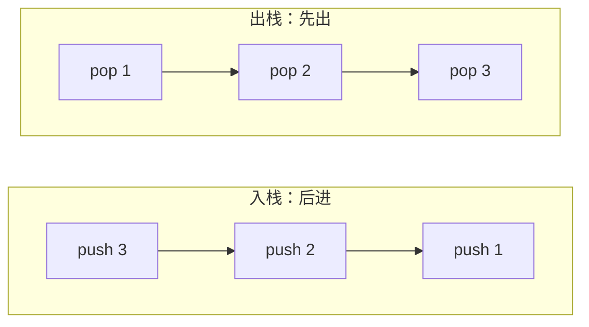

### 2. 核心操作（均为 O(1)）

| 操作               | 说明         |
| ---------------- | ---------- |
| `push(x)`        | 将元素 x 压入栈顶 |
| `pop()`          | 弹出栈顶元素     |
| `peek() / top()` | 查看栈顶元素但不弹出 |
| `isEmpty()`      | 判断栈是否为空    |

### 3. 两种实现方式对比

**① 数组实现**

```C
// C 语言数组实现栈（示意）
int stack[MAX_SIZE];
int top = -1;            // top 指向栈顶元素下标

void push(int x) {
    if (top < MAX_SIZE - 1)
        stack[++top] = x;      // 先移动指针再赋值
}
int pop() {
    return stack[top--];       // 先返回再移动指针
}
```

- 优点：实现简单，访问快，缓存友好。
- 缺点：栈大小固定，可能溢出或浪费空间。

**② 链表实现**

```Python
# Python 链表实现栈（示意）
class Node:
    def __init__(self, val):
        self.val = val
        self.next = None

class Stack:
    def __init__(self):
        self.top = None
    def push(self, val):        # 头插法
        node = Node(val)
        node.next = self.top
        self.top = node
    def pop(self):
        if not self.top: return None
        val = self.top.val
        self.top = self.top.next
        return val
```

- 优点：大小动态可变，不会溢出。
- 缺点：每个节点需要额外指针空间。

> 两种实现下，`push / pop / peek` 的时间复杂度都是 **O(1)**。

### 4. 常见应用场景

| 应用          | 说明                        |
| ----------- | ------------------------- |
| 函数调用栈       | 系统用栈保存函数调用现场，**递归的本质就是栈** |
| 括号匹配        | 左括号入栈、右括号出栈配对，检查表达式合法性    |
| 撤销/重做       | 编辑器记录操作历史，Ctrl+Z 即出栈      |
| 表达式求值       | 中缀转后缀、逆波兰表达式计算            |
| 深度优先搜索（DFS） | 显式用栈或系统递归栈实现遍历            |
| 浏览器前进/后退    | 用两个栈维护历史记录                |
| 单调栈         | 维护栈内单调性，快速求"下一个更大/更小元素"   |

### 5. 刷题巩固

- 有效的括号（LeetCode 20）、最小栈（155）
- 用栈实现队列（232）、逆波兰表达式求值（150）

---

## 四、队列（Queue）

### 1. 定义

队列是一种**只允许在一端（队尾 rear）插入、在另一端（队头 front）删除**的线性表，遵循 **FIFO（First In First Out，先进先出）** 原则。

- 类比：排队买票，先来的人先服务。

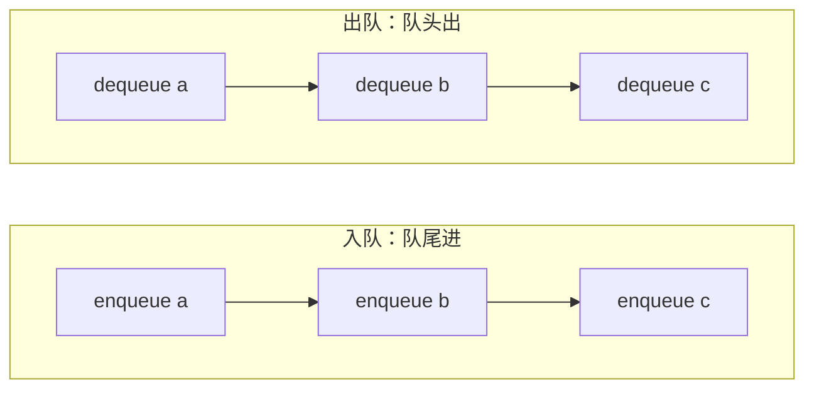

### 2. 核心操作

| 操作           | 说明            |
| ------------ | ------------- |
| `enqueue(x)` | 元素 x 入队（加到队尾） |
| `dequeue()`  | 队头元素出队        |
| `front()`    | 查看队头元素        |
| `isEmpty()`  | 判断队列是否为空      |

### 3. 数组实现的"假溢出"问题与循环队列

如果用普通数组实现队列，队头不断出队会导致 `front` 前移，队尾到达数组末尾后**即使数组前半部分空着也无法再入队**，这就是"假溢出"。

解决办法：**循环队列**（环形队列），让 `rear` 和 `front` 在到达末尾后回绕到数组开头，通过取模运算实现。

```C
#define MAX 100
int queue[MAX];
int front = 0, rear = 0;      // 约定：front 指向队头，rear 指向队尾的下一个位置

// 入队
void enqueue(int x) {
    if ((rear + 1) % MAX == front) return;   // 队满
    queue[rear] = x;
    rear = (rear + 1) % MAX;                  // 回绕
}
// 出队
int dequeue() {
    if (front == rear) return -1;             // 队空
    int x = queue[front];
    front = (front + 1) % MAX;
    return x;
}
```

循环队列的两个关键判定：

- **队空条件**：`front == rear`
- **队满条件**：`(rear + 1) % MAX == front`（牺牲一个存储单元来区分空/满）

### 4. 常用变体

| 变体          | 特点              | 典型实现                       |
| ----------- | --------------- | -------------------------- |
| 普通队列        | FIFO            | 循环队列 / 链表                  |
| 双端队列（deque） | 两端都可以插入删除       | Python `collections.deque` |
| 优先队列        | 按优先级出队，而不是按入队顺序 | **堆**（见第七节）                |
| 阻塞队列        | 空时等待、满时阻塞       | 生产者-消费者模型                  |

### 5. 常见应用场景

| 应用          | 说明                 |
| ----------- | ------------------ |
| 广度优先搜索（BFS） | 逐层遍历图/树时用队列保存待访问节点 |
| 任务调度        | 操作系统的就绪队列、进程调度     |
| 打印队列        | 多文档排队依次打印          |
| 消息队列        | 生产者-消费者模型、异步解耦     |
| 缓冲          | 键盘缓冲区、网络数据包缓冲      |

### 6. 刷题巩固

- 用队列实现栈（LeetCode 225）、设计循环队列（622）
- BFS 走迷宫（最短路径）、二叉树的层序遍历（102）

---

## 五、哈希表（Hash Table / 散列表）

### 1. 定义

哈希表是一种**以键值对（key → value）形式存储数据**的结构，它通过**哈希函数**把键 key 映射到数组中的某个位置（下标），从而直接定位数据。

- 理想情况下，查找、插入、删除的时间复杂度都是 **O(1)**，是"以空间换时间"的典型代表。
- 类比：字典的拼音索引、图书馆按编号找书。
- 与数组的关系：数组靠下标 O(1) 定位，哈希表则**把任意 key 转换成下标**，本质是"任意键 → 数组下标"的映射。

**为什么哈希表是无序的？**哈希表的位置由 `hash(key)` 决定而非插入顺序决定，冲突和扩容又进一步重排，所以天然无序；如果既要 O(1) 又要顺序，就加一条链表维护插入顺序（LinkedHashMap），要排序就用树。

### 2. 哈希函数（散列函数）

哈希函数把任意长度的 key 计算成一个整数下标。常见构造方法：

| 方法        | 思路                                    |
| --------- | ------------------------------------- |
| 直接定址法     | `f(key) = a * key + b`，取 key 本身或其线性函数 |
| 数字分析法     | 分析 key 各位数字分布，取分布较均匀的几位               |
| 平方取中法     | 取 key² 的中间几位作下标                       |
| 折叠法       | 把 key 分成几段再相加                         |
| **除留余数法** | `f(key) = key % p`，p 通常取不大于表长的质数（最常用） |

好的哈希函数应该：计算简单、分布均匀、冲突尽可能少。

### 3. 哈希冲突

不同的 key 经过哈希函数算出**相同的下标**，称为**哈希冲突**。由于 key 的数量通常远大于表长，冲突是**不可避免**的，只能尽量减少、妥善处理。

#### ① 开放定址法（Open Addressing）

发生冲突时，按规则继续探测下一个空位置：

- **线性探测**：依次向后找 `(hash(key) + i) % size`，`i = 0, 1, 2, ...`。实现简单，但容易产生"聚集"现象（冲突扎堆）。
  
  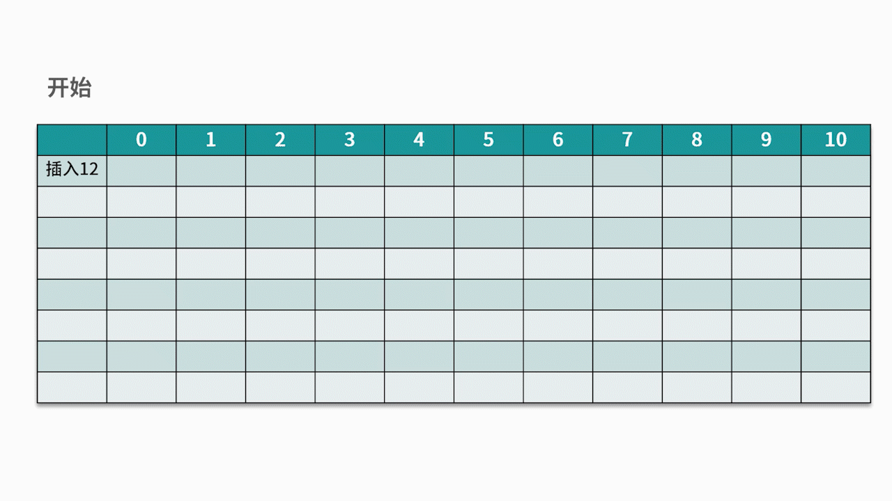

```Python
# 线性探测法示意
def insert(table, key, value):
    i = hash(key) % len(table)
    while table[i] is not None:      # 冲突就往后探测
        i = (i + 1) % len(table)
    table[i] = (key, value)
```

#### ② 链地址法（Separate Chaining / 拉链法）

每个数组位置挂一条链表（或红黑树），冲突的 key 都链在同一位置。**Java 的 HashMap 与 Python 的 dict 冲突解决本质上都基于此思想**（JDK 8 起链表过长时会转成红黑树）。

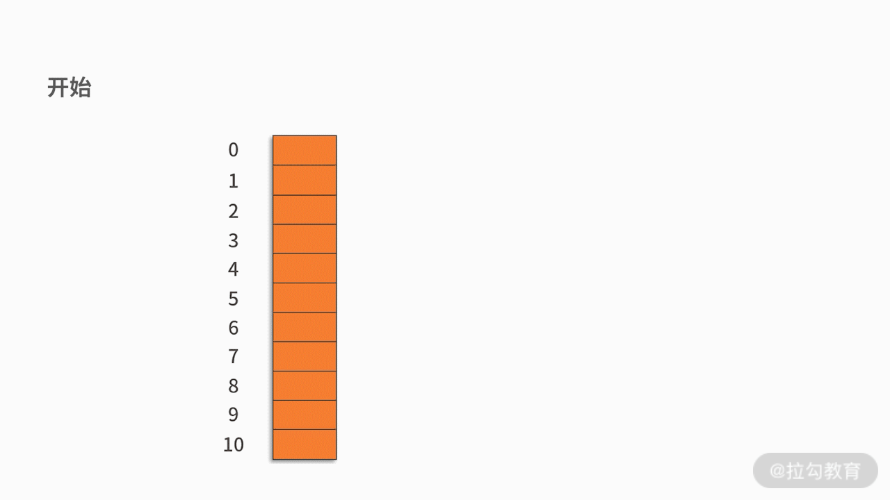

```Python
# 链地址法示意
class HashTable:
    def __init__(self, size=10):
        self.size = size
        self.table = [[] for _ in range(size)]
    def put(self, key, value):
        idx = hash(key) % self.size
        for i, (k, v) in enumerate(self.table[idx]):
            if k == key:
                self.table[idx][i] = (key, value)
                return
        self.table[idx].append((key, value))
    def get(self, key):
        idx = hash(key) % self.size
        for k, v in self.table[idx]:
            if k == key:
                return v
        return None
```

**扩容（rehash）**：当元素太多、装填因子（load factor = 元素数 / 表长）过大（一般超过 0.75）时，需要扩容并重新散列所有元素，代价较高，但均摊下来仍可接受。

### 4. 性能与特点

| 项目         | 说明                        |
| ---------- | ------------------------- |
| 平均时间复杂度    | 查找/插入/删除均为 O(1)           |
| 最坏时间复杂度    | 大量冲突时退化为 O(n)（需扩容或优化冲突策略） |
| 空间代价       | 需要预留较多空位，空间利用率不如数组/链表     |
| 扩容（rehash） | 元素过多时需扩容并重新散列，代价较高        |

### 5. 常见应用场景

| 应用         | 说明                                |
| ---------- | --------------------------------- |
| 字典/映射（Map） | Python dict、Java HashMap、JSON 对象  |
| 缓存         | Redis、Memcached 等按 key 快速存取       |
| 去重         | 判断元素是否已存在（HashSet）                |
| 数据库索引      | 等值查询场景的哈希索引                       |
| 计数统计       | 词频统计、投票计数                         |
| 布隆过滤器      | 用多个哈希函数 + 位数组，空间极省地判断"可能存在/一定不存在" |

### 6. 刷题巩固

- 两数之和（LeetCode 1）、有效的字母异位词（242）
- 字母异位词分组（49）、最长连续序列（128）

---

## 六、二叉树（Binary Tree）

### 1. 树的基本术语

| 术语         | 含义                            |
| ---------- | ----------------------------- |
| 根节点（Root）  | 树的最顶层节点，一棵树只有一个根              |
| 父节点 / 子节点  | 节点 A 向下连接的节点称为 A 的子节点，A 是其父节点 |
| 兄弟节点       | 拥有同一个父节点的节点                   |
| 叶子节点（Leaf） | 没有子节点的节点                      |
| 子树         | 每个节点连同其所有后代构成一棵子树             |
| 深度（Depth）  | 从根节点到该节点的边的条数                 |
| 高度（Height） | 从该节点到最远叶子节点的边的条数              |
| 层（Level）   | 根节点为第 1 层，向下逐层递增              |

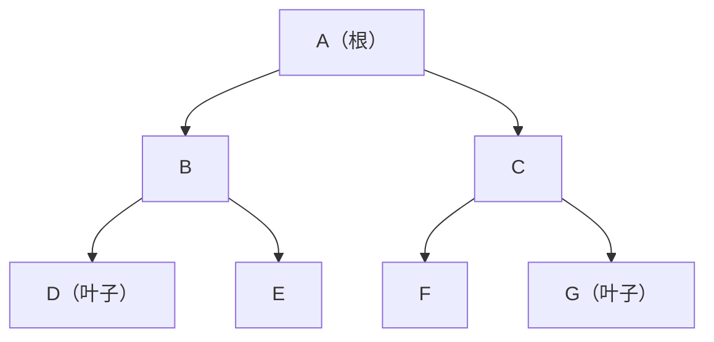

### 2. 二叉树的定义

**二叉树**是每个节点**最多有两个子节点**（左子节点、右子节点）的树形结构。注意：二叉树不是"树的特例"，而是独立的定义——区分左右子节点。

```C
// 二叉树节点定义（C 语言）
struct TreeNode {
    int val;
    struct TreeNode *left;
    struct TreeNode *right;
};
```

### 3. 特殊二叉树

| 类型              | 特点                          |
| --------------- | --------------------------- |
| 满二叉树（Full）      | 每个节点要么是叶子、要么有两个子节点，且叶子都在同一层 |
| 完全二叉树（Complete） | 除最后一层外每层都满，最后一层节点从左到右连续排列   |
| 二叉搜索树（BST）      | 左子树所有节点 < 根 < 右子树所有节点       |
| 平衡二叉树（AVL）      | 任意节点的左右子树高度差不超过 1，避免退化      |

 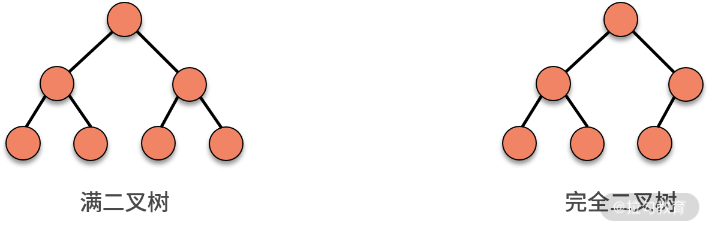

### 4. 二叉树的四种遍历

| 遍历方式     | 访问顺序      | 典型用途               |
| -------- | --------- | ------------------ |
| 前序遍历（先序） | 根 → 左 → 右 | 复制树、序列化            |
| 中序遍历     | 左 → 根 → 右 | **BST 中序遍历得到升序序列** |
| 后序遍历     | 左 → 右 → 根 | 删除树（先删子树再删根）、计算表达式 |
| 层序遍历     | 按层从左到右    | BFS、求树的最大宽度        |

以上图为例（根 A，左子树 B→D、E，右子树 C→F、G），四种遍历结果分别是：

- 前序：`A B D E C F G`
- 中序：`D B E A F C G`
- 后序：`D E B F G C A`
- 层序：`A B C D E F G`

```Python
# 四种遍历（Python 递归实现）
def preorder(root):
    if root:
        print(root.val, end=" ")
        preorder(root.left)
        preorder(root.right)

def inorder(root):
    if root:
        inorder(root.left)
        print(root.val, end=" ")
        inorder(root.right)

def postorder(root):
    if root:
        postorder(root.left)
        postorder(root.right)
        print(root.val, end=" ")

from collections import deque
def levelorder(root):
    q = deque([root])
    while q:
        node = q.popleft()
        print(node.val, end=" ")
        if node.left:  q.append(node.left)
        if node.right: q.append(node.right)
```

> 记忆技巧：前/中/后序的名字指的是**根节点**的位置；层序就是 BFS，用队列实现。

### 5. 二叉搜索树（BST）核心性质

- 左子树所有节点的值 < 根节点 < 右子树所有节点的值（左右子树也是 BST）。
- **中序遍历结果为升序序列**，可用来判断一棵树是否为 BST。
- 理想情况下（平衡时），查找/插入/删除的时间复杂度为 **O(log n)**。
- 若插入有序数据，树会退化成链表，最坏时间复杂度退化为 **O(n)**，此时需借助 AVL、红黑树等自平衡树。

```C
// BST 插入（C 语言，示意）
struct TreeNode* insert(struct TreeNode* root, int val) {
    if (root == NULL) {
        struct TreeNode* node = malloc(sizeof(struct TreeNode));
        node->val = val; node->left = node->right = NULL;
        return node;
    }
    if (val < root->val)      root->left  = insert(root->left, val);
    else if (val > root->val) root->right = insert(root->right, val);
    return root;
}
```

### 6. 平衡：AVL / 红黑树一句话理解

- **AVL 树**：严格平衡（左右子树高度差 ≤ 1），通过 **LL / RR / LR / RL 四种旋转**恢复平衡；查询快，但插入删除旋转频繁。
- **红黑树**：近似平衡（最长路径不超过最短路径 2 倍），旋转少，工程中用得多（如 TreeMap、HashMap 的桶）。

> 知道"BST 会退化 → 需要自平衡 → 平衡手段是旋转"这条逻辑链即可，细节用到再查。

### 7. 刷题巩固

- 二叉树的最大深度（104）、二叉树的中序遍历（94）
- 从前序与中序遍历构造二叉树（105）
- 验证二叉搜索树（98）、翻转二叉树（226）、层序遍历（102）

---

## 七、堆（Heap）

### 1. 定义

**堆**在逻辑上是一棵**完全二叉树**，同时满足**堆序性质**：

- **最大堆（大顶堆）**：每个节点的值都 **≥** 其子节点的值，堆顶是最大值。
- **最小堆（小顶堆）**：每个节点的值都 **≤** 其子节点的值，堆顶是最小值。

> 注意：堆只保证父子之间的序，不保证兄弟之间的序；它**不是**二叉搜索树。

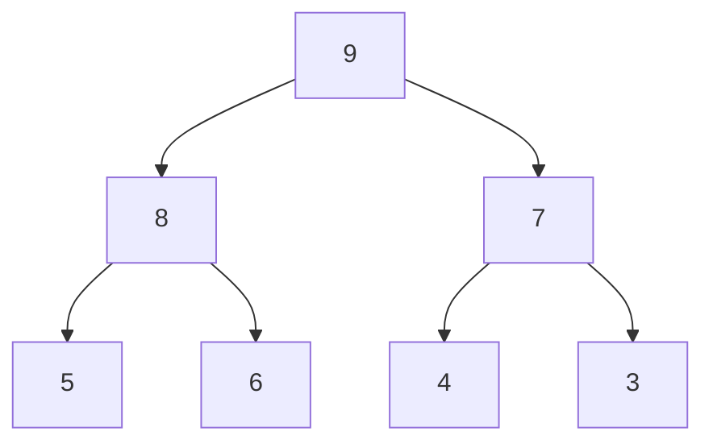

### 2. 数组存储（完全二叉树天然适合数组）

完全二叉树可以紧凑地存入数组，**不需要存储指针**。若数组下标从 1 开始，对下标为 i 的节点：

- 父节点：`parent(i) = i / 2`
- 左子节点：`left(i) = 2 * i`
- 右子节点：`right(i) = 2 * i + 1`

```text
例如最大堆：[9, 8, 7, 5, 6, 4, 3]（下标 1 起）
        9
       / \
      8   7
     / \ / \
    5  6 4  3
```

> 在 Python 的 `heapq` 等库中下标从 0 开始，公式变为 `parent = (i-1)//2`、`left = 2i+1`、`right = 2i+2`，原理相同。

### 3. 核心操作及复杂度

| 操作          | 做法                                               | 时间复杂度                     |
| ----------- | ------------------------------------------------ | ------------------------- |
| 插入          | 先加到末尾，再不断和父节点比较上浮（shift up / sift up）            | O(log n)                  |
| 删除堆顶        | 用末尾元素替换堆顶，再不断与较大的子节点交换下沉（shift down / sift down） | O(log n)                  |
| 取堆顶         | 直接返回数组第一个元素                                      | O(1)                      |
| 建堆（Heapify） | 从最后一个非叶子节点开始逐个下沉                                 | O(n)（比逐个插入 O(n log n) 更优） |

> 为什么建堆是 O(n) 而不是 O(n log n)？因为大部分节点在树的下层、高度小，下沉总次数是所有节点高度之和，约等于 2n，是 O(n)。这是面试高频考点。

```Python
# 最大堆插入（上浮）示意
def push(heap, x):
    heap.append(x)
    i = len(heap) - 1
    while i > 0 and heap[i] > heap[(i - 1) // 2]:   # 比父节点大就上浮
        heap[i], heap[(i - 1) // 2] = heap[(i - 1) // 2], heap[i]
        i = (i - 1) // 2
```

### 4. 堆 vs 普通数组实现优先队列

| 实现方式  | 入队           | 出队（取最大/最小）   |
| ----- | ------------ | ------------ |
| 普通数组  | O(1)         | O(n)（需线性扫描）  |
| 有序数组  | O(n)（需移动元素）  | O(1)         |
| **堆** | **O(log n)** | **O(log n)** |

堆在"入队、出队都频繁"的场景下综合表现最佳，因此**堆是优先队列最常用的实现**。

### 5. 常见应用场景

| 应用            | 说明                      |
| ------------- | ----------------------- |
| 优先队列          | 任务按优先级出队，如操作系统进程调度      |
| 堆排序           | 反复取堆顶，O(n log n) 且为原地排序 |
| TopK 问题       | 维护大小为 K 的小顶堆，快速求前 K 大   |
| 求中位数          | 大顶堆 + 小顶堆配合             |
| Dijkstra 最短路径 | 用最小堆优化每次取最小距离节点的操作      |

### 6. 刷题巩固

- 数组中的第 K 个最大元素（215）、前 K 个高频元素（347）
- 数据流的中位数（295）

---

## 八、递归（Recursion）

### 1. 什么是递归

**递归**是指在函数的定义中使用函数自身，即**函数调用自己**。

递归问题必须满足两个条件：

1. **可分解**：原问题可以分解为若干个规模更小、但**求解思路完全相同**的子问题。
2. **有终止条件**：不断拆解后一定会到达一个"最简单的问题"，直接给出答案，不再继续拆。

> 递归的数学模型就是**数学归纳法**：先证 n = 1 成立，再证"若 n 成立则 n+1 成立"。写递归也一样：**先写终止条件，再写递推公式**。

### 2. 写递归的三步

1. **找递推公式**：找出"大问题如何拆成小问题"的规律。
2. **找终止条件**：找出最简单的问题如何直接求解。
3. **翻译成代码**：把递推公式和终止条件写成函数。

```Python
# 例 1：阶乘  n! = n × (n-1)!
def factorial(n):
    if n <= 1:          # 终止条件
        return 1
    return n * factorial(n - 1)   # 递推公式
```

```Python
# 例 2：斐波那契  F(n) = F(n-1) + F(n-2)，F(1)=F(2)=1
def fib(n):
    if n <= 2:
        return 1
    return fib(n - 1) + fib(n - 2)   # 注意：存在大量重叠子问题
```

> 裸递归的斐波那契时间复杂度是 **O(2ⁿ)**，因为大量重复计算。用**备忘录（缓存）**记下已算过的结果即可降到 **O(n)**——这就是"空间换时间"，也是通往动态规划的第一步。

```Python
# 例 2 优化：备忘录（自顶向下）
memo = {}
def fib(n):
    if n <= 2:
        return 1
    if n not in memo:
        memo[n] = fib(n - 1) + fib(n - 2)
    return memo[n]
```

### 3. 经典案例：汉诺塔

问题：有 x、y、z 三根柱子，x 柱上有从小到大的 n 个圆盘，要求全部移到 z 柱。规则：一次只能移动一个盘，且大盘不能压在小盘上。

拆解成 3 个子问题：

1. 把 n-1 个盘子从 x 移到 y（借助 z）；
2. 把最大的盘子从 x 移到 z；
3. 把 n-1 个盘子从 y 移到 z（借助 x）。

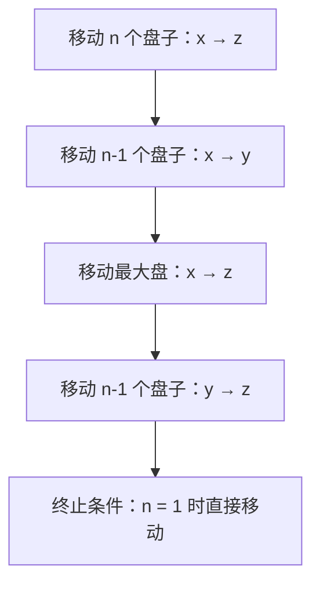

```Python
def hanoi(n, x, y, z):     # 把 n 个盘子从 x 借助 y 移到 z
    if n == 1:             # 终止条件
        print(f"{x} -> {z}")
        return
    hanoi(n - 1, x, z, y)  # 1. n-1 个盘子 x -> y（借助 z）
    print(f"{x} -> {z}")   # 2. 最大盘 x -> z
    hanoi(n - 1, y, x, z)  # 3. n-1 个盘子 y -> z（借助 x）
```

- 移动次数：`2ⁿ - 1`，所以时间复杂度是 **O(2ⁿ)**（汉诺塔本身就无法做得更快）。
- 汉诺塔的递归树展开就是一棵二叉树，可结合第六节"树"理解。

### 4. 递归 vs 迭代

| 对比项 | 递归                   | 迭代    |
| --- | -------------------- | ----- |
| 代码  | 简洁、贴近问题本身            | 稍繁琐   |
| 栈   | 依赖系统调用栈，深度过大易**栈溢出** | 不占调用栈 |
| 性能  | 有函数调用开销              | 通常更快  |

> 注意：Python 默认递归深度限制约 1000 层；Python 也不支持尾递归优化。深度可能很大的场景（如树退化成链表）优先用显式栈或迭代。

### 5. 刷题巩固

- 斐波那契数列（LeetCode 509）
- 反转链表（206，递归版）、合并两个有序链表（21）
- 自己实现汉诺塔，并画出 n = 3 的递归树

---

## 九、经典排序算法

### 1. 排序问题与评价维度

**排序**就是让一组无序数据变成有序（默认从小到大）。评价一个排序算法的优劣，看三个维度：

1. **时间复杂度**：最好、最坏、平均三种情况。
2. **空间复杂度**：是否为**原地排序**（空间复杂度 O(1)）。
3. **稳定性**：相等的元素排序后**相对顺序是否保持不变**（稳定 / 不稳定）。

### 2. 六种经典排序对比

| 算法   | 平均         | 最好         | 最坏         | 空间                 | 稳定性 | 思路一句话            |
| ---- | ---------- | ---------- | ---------- | ------------------ | --- | ---------------- |
| 冒泡排序 | O(n²)      | O(n)       | O(n²)      | O(1)               | 稳定  | 相邻比较，大的往后冒       |
| 插入排序 | O(n²)      | O(n)       | O(n²)      | O(1)               | 稳定  | 把元素插入到已排序区间的合适位置 |
| 选择排序 | O(n²)      | O(n²)      | O(n²)      | O(1)               | 不稳定 | 每轮选最小的放前面        |
| 归并排序 | O(n log n) | O(n log n) | O(n log n) | O(n)               | 稳定  | 分治：先拆成单个元素，再两两合并 |
| 快速排序 | O(n log n) | O(n log n) | O(n²)      | O(1)（递归栈 O(log n)） | 不稳定 | 选分区点，小的放左大的放右，递归 |
| 堆排序  | O(n log n) | O(n log n) | O(n log n) | O(1)               | 不稳定 | 建堆后反复取堆顶         |

> 记忆要点：**稳定**的常见排序只有：冒泡、插入、归并。选排序算法主要权衡"数据规模"和"稳定性需求"。

### 3. 快速排序（快排，最常用的 O(n log n) 排序）

```Python
def quick_sort(arr):
    if len(arr) <= 1:          # 终止条件
        return arr
    pivot = arr[len(arr) // 2]
    left  = [x for x in arr if x < pivot]
    mid   = [x for x in arr if x == pivot]
    right = [x for x in arr if x > pivot]
    return quick_sort(left) + mid + quick_sort(right)
```

- 平均 O(n log n)，**最坏 O(n²)**（每次分区都选到最大/最小值，如对已有序数组）。工程上用"三数取中"或随机选 pivot 规避。
- 不稳定、原地（交换法，递归栈 O(log n)）。

### 4. 归并排序（稳定的 O(n log n)）

```Python
def merge_sort(arr):
    if len(arr) <= 1:
        return arr
    mid = len(arr) // 2
    left  = merge_sort(arr[:mid])    # 分：拆到最小
    right = merge_sort(arr[mid:])
    return merge(left, right)        # 治：合并两个有序数组

def merge(a, b):
    res, i, j = [], 0, 0
    while i < len(a) and j < len(b):
        if a[i] <= b[j]:             # 等号保证稳定性
            res.append(a[i]); i += 1
        else:
            res.append(b[j]); j += 1
    return res + a[i:] + b[j:]
```

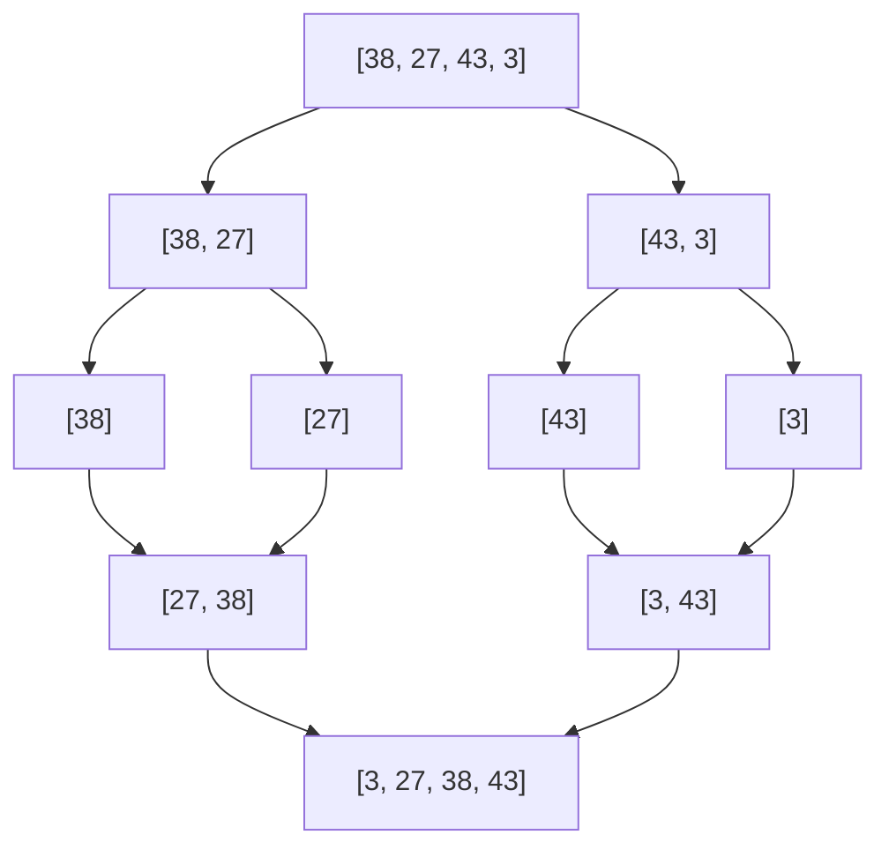

- 最好/最坏/平均都是 **O(n log n)**，稳定，代价是空间 **O(n)**（合并需要临时数组）。

### 5. 怎么选？

- **数据规模小**（如几百条）：O(n²) 和 O(n log n) 实际差距只有几十毫秒，用简单的插入排序反而常数小、代码稳。
- **数据规模大**：选 O(n log n)。需要**稳定** → 归并；**空间敏感** → 快排或堆排序；**要求最坏情况也有保障** → 堆排序。
- 实际工程中，语言内建排序通常就是"小规模插入排序 + 大规模快排（或归并）"的混合实现（如 Python 的 TimSort 就是归并 + 插入）。

### 6. 刷题巩固

- 排序数组（LeetCode 912）——手写快排/归并
- 数组中的第 K 个最大元素（215）——**快选（快排分区思想）**或堆，O(n)

---

## 十、算法思维进阶：分治 · 动态规划 · 贪心

### 1. 分治（Divide and Conquer）

**核心思想**：分而治之——把大规模难题拆成若干小规模、同类型、**互相独立**的子问题，逐个击破后再合并答案。

使用分治法的三个特征：

1. **问题可分**：能拆成若干规模更小的同类问题。
2. **解可合并**：子问题的解能合并出原问题的解（最关键）。
3. **相互独立**：子问题之间互不影响（如果不独立，分治会重复计算——那就要用动态规划）。

每轮递归都包含三步：**分解 → 解决 → 合并**。

**典型例子：二分查找**（前提是有序数组）——每次与中间值比较，把查找范围缩小一半：

```Python
def binary_search(arr, target):
    lo, hi = 0, len(arr) - 1
    while lo <= hi:
        mid = (lo + hi) // 2
        if arr[mid] == target:
            return mid
        elif arr[mid] < target:
            lo = mid + 1
        else:
            hi = mid - 1
    return -1
```

- 时间复杂度 **O(log n)**。数据量越大优势越明显：对 2³⁹ ≈ 5497 亿条有序数据，二分查找最多只需 **39 次**比较。

> 快排、归并、二分都是分治思想的经典应用。

### 2. 动态规划（Dynamic Programming）

**适用特征**（与分治的区别就在于第三条）：

1. **最优子结构**：原问题的最优解包含的子问题的解也是最优的。
2. **无后效性**：某阶段决策只影响未来，不影响过去。
3. **重叠子问题**：子问题会被反复计算——这正是动态规划要"用空间换时间"的地方。

**解题五步**（课程原话框架）：

1. 分阶段：把原问题划分成几个阶段（子问题）；
2. 找状态：定义状态变量（如 `dp[i]` 表示什么）；
3. 做决策：写出每个状态的选择；
4. 状态转移方程：**核心**，写出 `dp[i]` 与更小状态的关系；
5. 定目标 + 找终止条件：确定答案在哪里、初始值是什么。

**例子：爬楼梯**——每次可以爬 1 或 2 阶，爬到第 n 阶有多少种方法？

```Python
def climb_stairs(n):
    if n <= 2:
        return n
    dp = [0] * (n + 1)
    dp[1], dp[2] = 1, 2
    for i in range(3, n + 1):
        dp[i] = dp[i - 1] + dp[i - 2]   # 状态转移方程
    return dp[n]
```

- 状态：`dp[i]` = 爬到第 i 阶的方法数；转移方程：`dp[i] = dp[i-1] + dp[i-2]`。
- 空间可继续优化成两个变量，把空间复杂度降到 O(1)。

> 动态规划 ≈ **递归 + 备忘录（自顶向下）** 或 **自底向上的填表**。先会写递归，再背出备忘录，最后转成循环填表，是一条常见的学习路径。

### 3. 贪心（Greedy）

**核心思想**：每一步都做**当前看起来最优**的选择（局部最优），期望最终得到全局最优。

- 优点：简单、高效。
- 风险：**不是所有问题都适用**，局部最优不一定等于全局最优，需要先证明贪心策略正确。

**例子**：区间调度（选择尽可能多的不重叠区间）——按结束时间排序，每次选结束最早且与已选不冲突的区间。

> 三者一句话区分：**分治**拆成独立子问题；**动态规划**拆成有重叠的子问题并记住答案；**贪心**不拆，直接每步选最优。

### 4. 刷题巩固

- 爬楼梯（70）、打家劫舍（198）、最长递增子序列（300）
- 零钱兑换（322，经典"最少硬币数"）
- 贪心：分发饼干（455）、跳跃游戏（55）

---

## 十一、常用数据结构复杂度速查表

| 数据结构  | 查找                  | 插入          | 删除          | 说明            |
| ----- | ------------------- | ----------- | ----------- | ------------- |
| 数组    | O(1)（按下标）/ O(n)（按值） | O(n)        | O(n)        | 随机访问快         |
| 链表    | O(n)                | O(1)（已知位置）  | O(1)（已知位置）  | 插入删除快         |
| 栈     | O(n) 查找 / O(1) 取顶   | O(1)（栈顶）    | O(1)（栈顶）    | LIFO          |
| 队列    | O(n) 查找 / O(1) 取头   | O(1)（队尾）    | O(1)（队头）    | FIFO          |
| 哈希表   | O(1) 平均             | O(1) 平均     | O(1) 平均     | 最坏 O(n)       |
| 二叉搜索树 | O(log n) 平均         | O(log n) 平均 | O(log n) 平均 | 最坏 O(n)，平衡后稳定 |
| 堆     | O(1) 取堆顶            | O(log n)    | O(log n)    | 完全二叉树 + 堆序    |

---

## 十二、推荐学习资源与刷题清单

**课程（本文主要参考）：**

- 极客时间专栏《重学数据结构与算法》全文：https://learn.lianglianglee.com/专栏/重学数据结构与算法-完
  - 复杂度：01 讲；空间换时间：02 讲；线性表增删查：03-04 讲；栈：05 讲；队列：06 讲；数组：07 讲；树与二叉树：09 讲；哈希表：10 讲；递归：11 讲；分治：12 讲；排序：13 讲；动态规划：14 讲

**菜鸟教程（数据结构与算法）：**

- 数据结构教程总览：https://www.runoob.com/data-structures/data-structures-tutorial.html
- 栈：https://www.runoob.com/c-dsa/c-dsa-stack.html
- 队列：https://www.runoob.com/c-dsa/c-dsa-queue.html
- 树与二叉树：https://www.runoob.com/c-dsa/c-dsa-tree.html
- 二分搜索树：https://www.runoob.com/data-structures/binary-search-tree.html
- 堆的基本存储：https://www.runoob.com/data-structures/heap-storage.html
- 堆排序：https://www.runoob.com/data-structures/heap-sort.html

**其他参考：**

- 华为云博客《哈希表——高效查找的利器》：https://bbs.huaweicloud.com/blogs/290386
- 阿里云开发者社区·图文详解哈希表：https://developer.aliyun.com/article/923286

**刷题巩固建议（LeetCode）：**

- 数组：合并两个有序数组（88）、移除元素（27）、轮转数组（189）
- 栈：有效的括号（20）、最小栈（155）、用栈实现队列（232）、逆波兰表达式求值（150）
- 队列：用队列实现栈（225）、设计循环队列（622）、BFS 走迷宫
- 哈希表：两数之和（1）、有效的字母异位词（242）、字母异位词分组（49）、最长连续序列（128）
- 二叉树：最大深度（104）、中序遍历（94）、从前序与中序构造二叉树（105）、验证二叉搜索树（98）、翻转二叉树（226）
- 堆：数组中的第 K 个最大元素（215）、前 K 个高频元素（347）、数据流的中位数（295）
- 递归：斐波那契数列（509）、反转链表（206）、汉诺塔（自实现）
- 排序：排序数组（912）、数组中的第 K 个最大元素（215 快选）
- 动态规划：爬楼梯（70）、打家劫舍（198）、最长递增子序列（300）、零钱兑换（322）

---

*整理时间：2026-08-13 ｜ 内容综合自菜鸟教程、公开技术博客及极客时间专栏《重学数据结构与算法》，仅供学习使用。*
