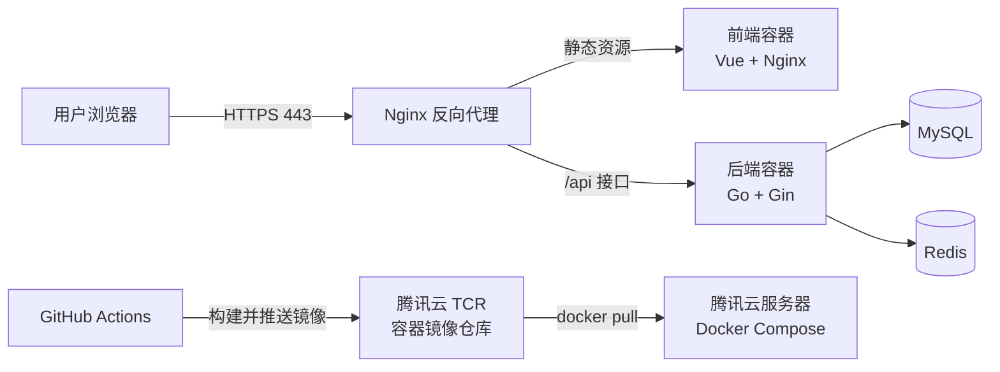
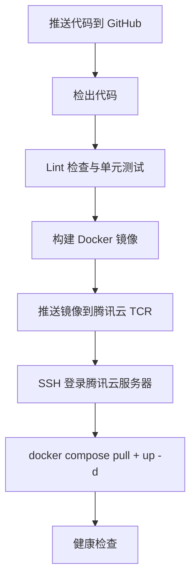

> 说明：本文是一篇面向「自己动手把项目部署上云」的实操技术文档，默认云服务商为**腾讯云**。示例项目为 [GoCommunity](https://github.com/changhen2004/GoCommunity)（Go + Gin + GORM + Redis 后端、Vue 前端的高并发资源社区平台）。文中所有命令与配置均以「不修改业务代码、只补部署所需配置」为前提，完整覆盖从容器化、CI/CD 流水线到生产部署与安全运维的全流程。

## 一、整体架构与流程概览

在动手之前，先把「最终长什么样」想清楚。本文采用的是一条**最小可行、便于扩展**的部署链路：



整条流水线可以抽象为下面这几个环节：



后面五个章节，就分别对应这条链路上的每一环。

---

## 二、第一步：准备工作

在开始之前，先把下面几样东西准备好。**这几项都属于「一次性准备」，后续流水线跑起来后基本不再需要手动干预。**

### 2.1 云服务器

| 项目类型 | 推荐机型 | 推荐配置 | 说明 |
| --- | --- | --- | --- |
| 个人项目 / 测试 | 腾讯云**轻量应用服务器（Lighthouse）** | 2 核 4 G | 价格便宜、开箱即用，自带防火墙，适合小项目 |
| 中小型生产环境 | 腾讯云**云服务器 CVM** | 4 核 8 G | 网络与安全组更灵活，适合正式对外服务 |

选购时注意三点：

1. **地域**：选择离目标用户最近的地域（如面向国内用户选「广州 / 上海」，面向海外选「香港 / 新加坡」）。
2. **系统镜像**：建议选择 **Ubuntu 22.04 / 24.04** 或 **Debian 12** 等主流 Linux 发行版，社区资料最全。
3. **公网 IP**：购买时勾选「分配公网 IP」，后续域名解析和 SSH 登录都依赖它。

> 轻量应用服务器（Lighthouse）与云服务器（CVM）的区别：Lighthouse 用**防火墙**（控制台直接放行端口），CVM 用**安全组**（放行入站规则）。两者本质相同，只是入口位置不同，下文会分别说明。

### 2.2 域名（可选，国内服务器强烈建议）

如果希望通过 `https://example.com` 这种域名访问，需要提前准备：

1. **注册域名**：在腾讯云 [域名注册](https://console.cloud.tencent.com/domain) 购买一个域名。
2. **完成备案（国内服务器必需）**：域名绑定**中国大陆**服务器对外提供 Web 服务前，必须先完成 **ICP 备案**。备案在腾讯云备案系统提交，通常需要数天到数周不等，**建议提前启动**，不要等部署完再备案。
   - 如果只是个人学习、用 IP 或临时域名访问，可以暂时跳过备案，但正式对外服务务必先备案。
3. **DNS 解析**：备案通过后，在 [DNSPod 控制台](https://console.cloud.tencent.com/cns) 添加一条 `A` 记录，把域名指向服务器的公网 IP。

### 2.3 GitHub 仓库

确认代码已经推到 GitHub 仓库（示例：[changhen2004/GoCommunity](https://github.com/changhen2004/GoCommunity)），并保证：

- 默认分支为 `main`（本文流水线以 `main` 为触发分支）。
- 项目里 `go.mod`、`package.json` 等依赖清单文件齐全。

### 2.4 SSH 密钥（用于 CI/CD 免密登录服务器）

后续 GitHub Actions 需要**免密登录服务器**执行部署命令，因此要提前准备一对 SSH 密钥：

1. 在本地（或任意可信环境）生成密钥对：

   ```bash
   ssh-keygen -t ed25519 -C "github-actions-deploy" -f ~/.ssh/gocommunity_deploy
   ```

2. 把**公钥**（`gocommunity_deploy.pub` 的内容）写入服务器：

   ```bash
   # 在服务器上执行
   mkdir -p ~/.ssh && chmod 700 ~/.ssh
   # 把公钥内容追加到 authorized_keys
   echo "ssh-ed25519 AAAA...  github-actions-deploy" >> ~/.ssh/authorized_keys
   chmod 600 ~/.ssh/authorized_keys
   ```

3. 把**私钥**（`gocommunity_deploy` 的内容）保存好，稍后填入 GitHub Secrets（见 4.4 节）。

---

## 三、第二步：为项目添加 Docker 支持（容器化）

容器化是「环境一致 + 自动化部署」的根基：本地、CI、服务器三处跑的是**同一个镜像**，从根上避免「本地能跑、线上报错」。

### 3.1 编写后端 Dockerfile（Go + Gin + GORM）

Go 后端适合用**多阶段构建（multi-stage build）**：第一阶段编译出二进制，第二阶段只保留运行所需的最小文件，最终镜像小、攻击面少。

```dockerfile
# backend/Dockerfile
# ---------- 构建阶段 ----------
FROM golang:1.23-alpine AS builder

WORKDIR /app

# 国内环境可加速依赖下载
ENV GOPROXY=https://goproxy.cn,direct \
    CGO_ENABLED=0 \
    GOOS=linux

# 先复制依赖清单，充分利用 Docker 层缓存
COPY go.mod go.sum ./
RUN go mod download

# 再复制源码并编译
COPY . .
RUN go build -ldflags="-s -w" -o /app/server ./cmd/server

# ---------- 运行阶段 ----------
FROM alpine:3.20

# 时区 + CA 证书，避免容器内时间错乱、无法访问 HTTPS 服务
RUN apk add --no-cache tzdata ca-certificates && \
    adduser -D -u 10001 appuser

WORKDIR /app
COPY --from=builder /app/server ./server
# 配置文件等运行时资源（如 configs/ 目录）按需复制
COPY --from=builder /app/configs ./configs

USER appuser
EXPOSE 8080
ENTRYPOINT ["./server"]
```

> 提示：`./cmd/server` 是常见的 Go 项目入口目录，`8080` 是示例端口，请以 GoCommunity 实际的项目结构与监听端口为准，替换成本项目的真实路径即可。

### 3.2 编写前端 Dockerfile（Vue + Nginx）

前端构建产物是纯静态文件，同样用多阶段构建：第一阶段用 Node 打包，第二阶段交给 Nginx 提供静态服务。

```dockerfile
# frontend/Dockerfile
# ---------- 构建阶段 ----------
FROM node:20-alpine AS builder

WORKDIR /app
# 国内环境可切换 npm 镜像
RUN npm config set registry https://registry.npmmirror.com

COPY package*.json ./
RUN npm ci

COPY . .
RUN npm run build

# ---------- 运行阶段 ----------
FROM nginx:1.27-alpine

COPY --from=builder /app/dist /usr/share/nginx/html
# 前端自己的 Nginx 配置（含 SPA 路由回退等）
COPY nginx.conf /etc/nginx/conf.d/default.conf

EXPOSE 80
```

前端 `nginx.conf` 里通常需要处理 **SPA 路由**（如 Vue Router 的 history 模式），让刷新页面时回退到 `index.html`：

```nginx
# frontend/nginx.conf
server {
    listen 80;
    server_name _;
    root /usr/share/nginx/html;
    index index.html;

    # history 路由模式：找不到文件时回退到 index.html
    location / {
        try_files $uri $uri/ /index.html;
    }
}
```

### 3.3 编写 docker-compose.yml（多服务编排）

在**项目根目录**创建 `docker-compose.yml`，把前端、后端、数据库等所有服务统一编排，这是本地联调和服务器部署的关键文件：

```yaml
# docker-compose.yml
services:
  mysql:
    image: mysql:8.0
    restart: always
    environment:
      MYSQL_ROOT_PASSWORD: ${MYSQL_ROOT_PASSWORD}
      MYSQL_DATABASE: gocommunity
    volumes:
      - mysql_data:/var/lib/mysql
    # 生产环境数据库不直接暴露到公网，仅容器内互通
    ports:
      - "127.0.0.1:3306:3306"

  redis:
    image: redis:7-alpine
    restart: always
    command: ["redis-server", "--appendonly", "yes"]
    volumes:
      - redis_data:/data
    ports:
      - "127.0.0.1:6379:6379"

  backend:
    build: ./backend
    restart: always
    depends_on:
      mysql:
        condition: service_healthy
      redis:
        condition: service_started
    environment:
      DB_HOST: mysql
      DB_PORT: "3306"
      DB_NAME: gocommunity
      DB_USER: root
      DB_PASSWORD: ${MYSQL_ROOT_PASSWORD}
      REDIS_ADDR: redis:6379
      # 其他后端配置 ...
    ports:
      - "127.0.0.1:8080:8080"

  frontend:
    build: ./frontend
    restart: always
    depends_on:
      - backend
    ports:
      - "127.0.0.1:80:80"

volumes:
  mysql_data:
  redis_data:
```

要点说明：

- 用 `${MYSQL_ROOT_PASSWORD}` 这类**环境变量占位符**，实际值由部署环境的 `.env` 文件或 CI 注入，**绝不写死密码**。
- 数据库 / 后端 / 前端端口都用 `127.0.0.1:` 前缀只绑定本机，不直接暴露到公网，公网访问统一走外层 Nginx 反向代理（见 6.2 节）。

### 3.4 本地测试

在本地执行下面的命令，验证整个应用能否在容器里正常跑起来：

```bash
# 在项目根目录
docker compose up --build
```

看到各服务正常启动、前端页面能打开、接口能调通后，再 `Ctrl+C` 或：

```bash
docker compose down
```

> 本地验证通过，说明镜像构建与多容器编排没有问题，可以放心交给 CI/CD 流水线。

---

## 四、第三步：搭建 CI/CD 流水线（GitHub Actions）

这里选 **GitHub Actions**，因为它与 GitHub 仓库集成度最高、配置直观。镜像仓库选**腾讯云容器镜像服务 TCR（个人版）**，与腾讯云生态无缝衔接且个人版免费。

### 4.1 创建腾讯云 TCR 镜像仓库

1. 登录 [容器镜像服务 TCR 控制台](https://console.cloud.tencent.com/tcr)，开通**个人版**（免费）。
2. 新建一个**命名空间**（例如 `gocommunity`）。
3. 在该命名空间下新建镜像仓库（例如 `backend`、`frontend` 两个仓库）。
4. 记下镜像地址格式：

   ```text
   ccr.ccs.tencentyun.com/<命名空间>/<仓库名>:<tag>
   # 例如：
   ccr.ccs.tencentyun.com/gocommunity/backend:latest
   ccr.ccs.tencentyun.com/gocommunity/frontend:latest
   ```

5. 在 TCR 控制台「访问凭证」里**创建/记录用户名与访问令牌（token）**，稍后填入 GitHub Secrets。

### 4.2 创建工作流文件

在项目根目录创建 `.github/workflows/deploy.yml`。一个标准流水线包含：**代码检出 → 代码检查与测试 → 构建镜像 → 推送镜像 → SSH 部署 → 健康检查**。

### 4.3 完整工作流示例

```yaml
# .github/workflows/deploy.yml
name: Build and Deploy to Tencent Cloud

on:
  push:
    branches: [main]
  workflow_dispatch:          # 支持手动触发

env:
  TCR_REGISTRY: ccr.ccs.tencentyun.com
  TCR_NAMESPACE: gocommunity

jobs:
  # 阶段一：代码检查与测试
  test:
    runs-on: ubuntu-latest
    steps:
      - name: Checkout
        uses: actions/checkout@v4

      # 后端 Lint + 单元测试（示例）
      - name: Setup Go
        uses: actions/setup-go@v5
        with:
          go-version: "1.23"
      - name: Backend test
        run: |
          cd backend
          go vet ./...
          go test ./...

      # 前端 Lint（示例，可按需启用）
      - name: Setup Node
        uses: actions/setup-node@v4
        with:
          node-version: "20"
      - name: Frontend lint
        run: |
          cd frontend
          npm ci
          npm run lint

  # 阶段二：构建镜像 + 推送 TCR + 部署
  build-and-deploy:
    needs: test
    runs-on: ubuntu-latest
    steps:
      - name: Checkout
        uses: actions/checkout@v4

      - name: Set up Docker Buildx
        uses: docker/setup-buildx-action@v3

      # 登录腾讯云 TCR
      - name: Login to Tencent TCR
        uses: docker/login-action@v3
        with:
          registry: ${{ env.TCR_REGISTRY }}
          username: ${{ secrets.TCR_USERNAME }}
          password: ${{ secrets.TCR_PASSWORD }}

      # 构建并推送后端镜像
      - name: Build and push backend
        uses: docker/build-push-action@v6
        with:
          context: ./backend
          push: true
          tags: ${{ env.TCR_REGISTRY }}/${{ env.TCR_NAMESPACE }}/backend:latest

      # 构建并推送前端镜像
      - name: Build and push frontend
        uses: docker/build-push-action@v6
        with:
          context: ./frontend
          push: true
          tags: ${{ env.TCR_REGISTRY }}/${{ env.TCR_NAMESPACE }}/frontend:latest

      # 通过 SSH 登录服务器，拉取最新镜像并重启服务
      - name: Deploy via SSH
        uses: appleboy/ssh-action@v1
        with:
          host: ${{ secrets.SERVER_HOST }}
          username: ${{ secrets.SERVER_USER }}
          key: ${{ secrets.SERVER_SSH_KEY }}
          script: |
            cd /opt/gocommunity
            docker login ccr.ccs.tencentyun.com -u ${{ secrets.TCR_USERNAME }} -p ${{ secrets.TCR_PASSWORD }}
            docker compose pull
            docker compose up -d --remove-orphans
            docker image prune -f

      # 健康检查：部署完成后验证服务是否正常响应
      - name: Health check
        run: |
          sleep 10
          curl -fsS http://${{ secrets.SERVER_HOST }}/healthz && echo "OK"
```

### 4.4 配置 GitHub Secrets（敏感信息不落库）

在仓库 `Settings → Secrets and variables → Actions → New repository secret` 添加以下密钥，**绝不要把密码写进代码或工作流文件**：

| Secret 名称 | 含义 | 获取来源 |
| --- | --- | --- |
| `TCR_USERNAME` | 腾讯云 TCR 用户名 | TCR 控制台「访问凭证」 |
| `TCR_PASSWORD` | 腾讯云 TCR 访问令牌 | TCR 控制台「访问凭证」 |
| `SERVER_HOST` | 服务器公网 IP | 腾讯云控制台 |
| `SERVER_USER` | SSH 登录用户名 | 服务器（如 `ubuntu` / `root`） |
| `SERVER_SSH_KEY` | SSH 私钥内容 | 2.4 节生成的私钥 |

> 补充：若服务器上需要用 `docker compose pull` 拉取私有镜像，服务器也要先 `docker login`；上面脚本里已包含登录步骤，凭证同样通过 Secret 注入。

---

## 五、第四步：部署到云服务器

根据项目复杂度，有两种主流方式。**中小型项目（本文场景）推荐方式一**，简单直接；大型微服务再考虑方式二。

### 5.1 方式一：Docker Compose 部署（适合中小型项目）

#### 5.1.1 服务器准备：安装 Docker 与 Docker Compose

以 Ubuntu 为例，在服务器上执行（腾讯云镜像源加速，国内网络更稳）：

```bash
# 1. 安装 Docker（使用腾讯云 apt 镜像源）
sudo apt-get update
sudo apt-get install -y ca-certificates curl
sudo install -m 0755 -d /etc/apt/keyrings
curl -fsSL https://mirrors.cloud.tencent.com/docker-ce/linux/ubuntu/gpg | \
  sudo gpg --dearmor -o /etc/apt/keyrings/docker.gpg
echo "deb [arch=$(dpkg --print-architecture) signed-by=/etc/apt/keyrings/docker.gpg] \
  https://mirrors.cloud.tencent.com/docker-ce/linux/ubuntu $(. /etc/os-release && echo $VERSION_CODENAME) stable" | \
  sudo tee /etc/apt/sources.list.d/docker.list > /dev/null
sudo apt-get update
sudo apt-get install -y docker-ce docker-ce-cli containerd.io docker-buildx-plugin docker-compose-plugin

# 2. 启动并设置开机自启
sudo systemctl enable --now docker

# 3. 让当前用户免 sudo 使用 docker（可选）
sudo usermod -aG docker $USER
# 重新登录后生效

# 4. 验证
docker --version
docker compose version
```

#### 5.1.2 服务器放行端口

- **轻量应用服务器**：控制台 → 实例 → **防火墙** → 添加规则，放行 `22`（SSH）、`80`（HTTP）、`443`（HTTPS）。数据库端口 `3306/6379` 因为只绑定 `127.0.0.1`，**无需放行**。
- **云服务器 CVM**：控制台 → **安全组** → 入站规则，同样放行 `22/80/443`。

#### 5.1.3 在服务器准备部署目录与 .env

```bash
mkdir -p /opt/gocommunity && cd /opt/gocommunity
# 编写 .env（内容即数据库密码等敏感配置，权限设为仅本人可读）
cat > .env <<'EOF'
MYSQL_ROOT_PASSWORD=改成你的强密码
EOF
chmod 600 .env
```

部署目录里还需要一份 `docker-compose.yml`（即 3.3 节那份文件，去掉 `build:` 换成 `image:` 指向 TCR 镜像即可，或直接让 CI 脚本把仓库里的 compose 文件拉下来）。服务器版 compose 建议用 `image:` 指向镜像仓库，避免在服务器上重新构建：

```yaml
# 服务器上的 docker-compose.yml（生产版，使用镜像而非本地构建）
services:
  backend:
    image: ccr.ccs.tencentyun.com/gocommunity/backend:latest
    # ... 其余同 3.3 节
  frontend:
    image: ccr.ccs.tencentyun.com/gocommunity/frontend:latest
    # ... 其余同 3.3 节
```

#### 5.1.4 部署与更新

首次部署和后续更新**用的是同一条命令**，这正是 Compose 部署的优雅之处：

```bash
cd /opt/gocommunity
docker compose pull          # 拉取最新镜像
docker compose up -d         # 后台启动/滚动更新服务
docker compose ps            # 查看运行状态
```

更新流程就是：CI 流水线里执行 `pull + up -d`，服务器上的容器会被自动替换为最新镜像。

### 5.2 方式二：Kubernetes 部署（适合大型、微服务项目）

如果项目是微服务架构，或需要弹性伸缩、自动恢复、滚动发布等高级能力，Kubernetes 是更合适的选择。在腾讯云下，推荐直接使用托管服务 **TKE（腾讯云容器服务）**，省去自建集群的运维成本。

#### 5.2.1 准备 K8s 集群

- 在 [腾讯云容器服务 TKE](https://console.cloud.tencent.com/tke2) 创建集群，选择托管模式。
- 本地安装 `kubectl`，并通过 TKE 控制台下载集群的 kubeconfig，完成连接：

  ```bash
  kubectl get nodes   # 能看到节点即连接成功
  ```

#### 5.2.2 编写 K8s 资源文件

为应用编写 Deployment、Service、Ingress 等 YAML，示例（后端）：

```yaml
# k8s/backend-deployment.yaml
apiVersion: apps/v1
kind: Deployment
metadata:
  name: backend
spec:
  replicas: 3                    # 多副本，支持横向伸缩
  selector:
    matchLabels:
      app: backend
  template:
    metadata:
      labels:
        app: backend
    spec:
      containers:
        - name: backend
          image: ccr.ccs.tencentyun.com/gocommunity/backend:latest
          ports:
            - containerPort: 8080
          env:
            - name: DB_PASSWORD
              valueFrom:
                secretKeyRef:      # 密钥用 K8s Secret 注入
                  name: db-secret
                  key: password
---
apiVersion: v1
kind: Service
metadata:
  name: backend
spec:
  selector:
    app: backend
  ports:
    - port: 8080
      targetPort: 8080
```

再配合 Ingress（可接腾讯云 CLB 负载均衡 + 域名）对外暴露服务。完整方案可参考 [TKE 官方文档](https://cloud.tencent.com/document/product/457)。

#### 5.2.3 配置部署

在 CI/CD 流水线的部署阶段，用 `kubectl apply -f` 应用配置：

```bash
kubectl apply -f k8s/
kubectl rollout status deployment/backend   # 等待滚动发布完成
```

---

## 六、第五步：安全与运维

上线不是终点，安全和可运维性同样重要。下面几条是**最低限度必须做到**的。

### 6.1 环境变量与密钥管理

**绝对不要**把数据库密码、API 密钥等敏感信息硬编码进代码、Dockerfile 或镜像里。正确做法：

- **CI/CD 侧**：用 GitHub Secrets 存储，通过 `${{ secrets.XXX }}` 注入（见 4.4 节）。
- **服务器侧**：用 `.env` 文件存放，`chmod 600` 限制权限，并加入 `.gitignore`、不要提交到仓库。
- **K8s 侧**：用 `Secret` 对象存放，通过 `secretKeyRef` 注入。

### 6.2 配置反向代理与 SSL（HTTPS）

生产环境通常用 **Nginx 作为反向代理**，统一入口、转发到后端，并配置 SSL 证书实现 HTTPS。

- **SSL 证书**：在 [腾讯云 SSL 证书控制台](https://console.cloud.tencent.com/ssl) 申请免费 DV 证书（一年期，可续期），或使用 Let's Encrypt（`certbot`）自动签发与续期。
- **Nginx 反向代理示例**：

```nginx
# /etc/nginx/conf.d/gocommunity.conf
server {
    listen 80;
    server_name example.com;
    # HTTP 强制跳转 HTTPS
    return 301 https://$host$request_uri;
}

server {
    listen 443 ssl;
    server_name example.com;

    ssl_certificate     /etc/nginx/ssl/example.com_bundle.crt;
    ssl_certificate_key /etc/nginx/ssl/example.com.key;

    # 前端静态资源
    location / {
        proxy_pass http://127.0.0.1:80;
    }

    # 后端 API
    location /api/ {
        proxy_pass http://127.0.0.1:8080;
        proxy_set_header Host $host;
        proxy_set_header X-Real-IP $remote_addr;
        proxy_set_header X-Forwarded-For $proxy_add_x_forwarded_for;
        proxy_set_header X-Forwarded-Proto $scheme;
    }

    # 健康检查
    location /healthz {
        proxy_pass http://127.0.0.1:8080;
    }
}
```

### 6.3 设置健康检查

在 CI/CD 流水线最后加一步健康检查（见 4.3 节末尾），确认应用部署成功后能正常响应：

```bash
curl -fsS http://<服务器IP>/healthz && echo "部署成功"
```

- 后端暴露一个 `/healthz`（或 `/health`）接口，返回 `200` 即代表服务就绪。
- 部署失败时流水线会因此步骤报错，方便第一时间发现并回滚。

### 6.4 其他运维建议（进阶）

- **日志**：`docker compose logs -f backend` 查看实时日志；生产可接日志采集服务。
- **数据备份**：MySQL 定期 `mysqldump` 备份，或用云厂商的快照/备份策略。
- **镜像安全**：基础镜像尽量用官方 `alpine` 精简版，定期 `docker image prune` 清理无用镜像。
- **回滚**：给镜像打上 `git commit` 短哈希作为 tag，出问题时直接 `docker compose up -d` 回退到上一个 tag。

---

## 七、总结

整条部署链路回顾一遍：

1. **准备**：买好腾讯云服务器、域名并备案、准备 GitHub 仓库与 SSH 密钥。
2. **容器化**：写后端 / 前端 `Dockerfile` 与根目录 `docker-compose.yml`，本地 `docker compose up --build` 验证。
3. **流水线**：建 TCR 镜像仓库，写 `.github/workflows/deploy.yml`，配置 GitHub Secrets。
4. **部署**：服务器装好 Docker/Compose 并放行端口，CI 通过 SSH 执行 `docker compose pull + up -d`（中小型项目）；大型微服务改用 TKE + `kubectl apply`。
5. **安全运维**：敏感信息走 Secret/`.env`，Nginx 反向代理 + SSL 证书，流水线加健康检查。

只要这五步走通，后续每次 `git push` 到 `main`，代码就会自动构建、推送镜像并滚动更新到腾讯云服务器——**一次配置，长期复用**。

---

## 参考资料

- 项目仓库：[GoCommunity](https://github.com/changhen2004/GoCommunity)
- 腾讯云轻量应用服务器：[产品文档](https://cloud.tencent.com/document/product/1207)
- 腾讯云云服务器 CVM：[产品文档](https://cloud.tencent.com/document/product/213)
- 腾讯云容器镜像服务 TCR：[产品文档](https://cloud.tencent.com/document/product/1141)
- 腾讯云容器服务 TKE：[产品文档](https://cloud.tencent.com/document/product/457)
- 腾讯云 SSL 证书：[产品文档](https://cloud.tencent.com/document/product/400)
- 腾讯云域名与备案：[域名注册](https://cloud.tencent.com/document/product/242) / [网站备案](https://cloud.tencent.com/document/product/243)
- Docker 官方文档：<https://docs.docker.com/>
- Docker Compose 文档：<https://docs.docker.com/compose/>
- GitHub Actions 文档：<https://docs.github.com/actions>
