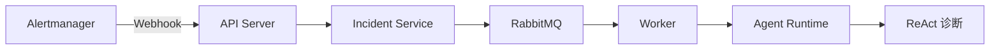
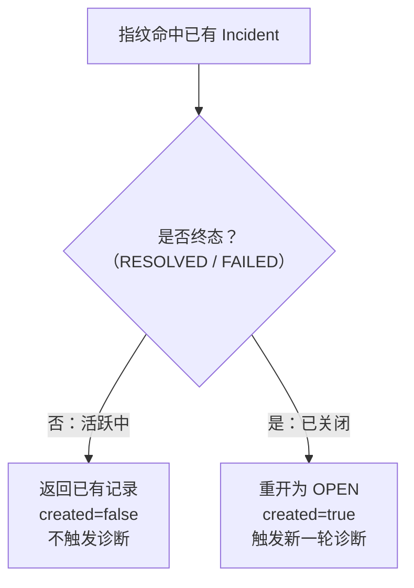
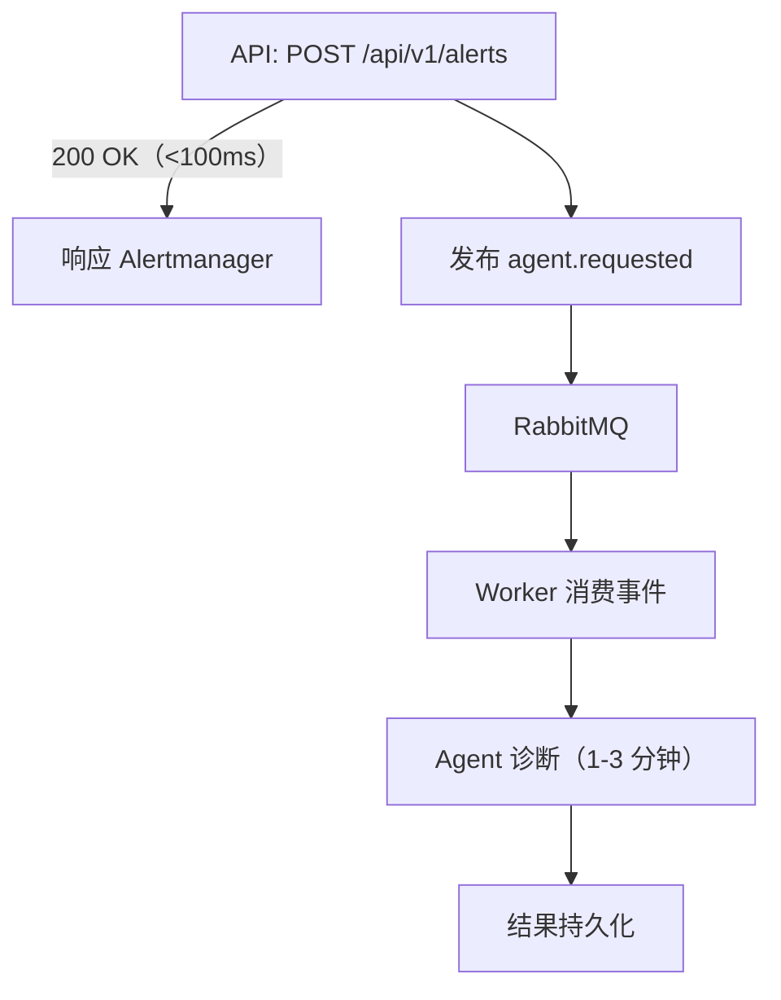
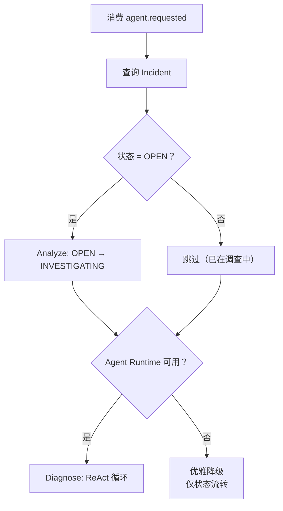
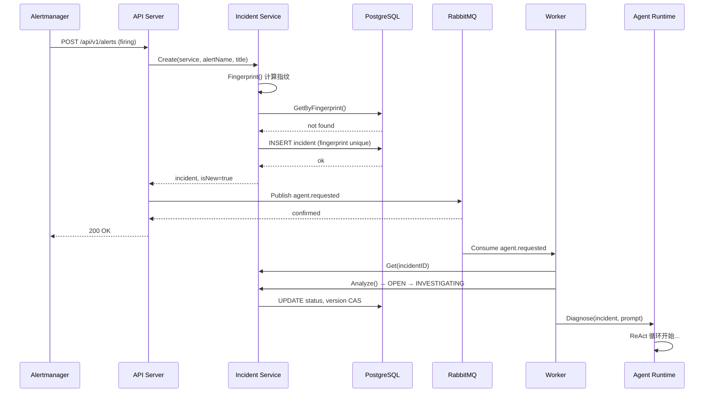

> 本文是「GoOnCall Agent 设计系列」的第二篇，聚焦告警链路——从 Alertmanager Webhook 到 Agent 自动诊断的完整链路。
>
> 项目地址：[GoOnCall-Agent](https://github.com/changhen2004/GoOnCall-Agent)
>
> 前篇：[Go Agent 设计总纲——从 ReAct 循环到 AIOps 闭环]()

---

## 1. 告警链路要解决什么问题

在 AIOps 场景中，告警是 Agent 的"触发器"。一条告警从 Prometheus 产生，到 Agent 开始诊断，中间要经过一系列确定性环节：



这条链路看起来简单，但每一个环节都有需要仔细处理的问题：

- **去重**：同一条告警在 firing 期间会重复通知，不能重复建单
- **复发**：已经关闭的 Incident 如果告警再次 firing，需要重新打开
- **并发**：多个 Worker 可能同时处理同一个 Incident，需要防止状态冲突
- **可靠性**：消息不能丢，投递失败要有明确的错误信号
- **异步**：Agent 诊断可能需要几分钟，不能阻塞 HTTP 请求

下面逐一展开。

---

## 2. Webhook 接收：告警入口

### 2.1 Alertmanager 配置

Alertmanager 按 `alertname + service` 分组，将 firing 和 resolved 通知推送到 GoOnCall 的 Webhook 端点：

```yaml
# deploy/alertmanager/alertmanager.yml
route:
  group_by: ['alertname', 'service']
  receiver: 'gooncall'

receivers:
  - name: 'gooncall'
    webhook_configs:
      - url: 'http://gooncall-api:8080/api/v1/alerts'
        send_resolved: true
```

`send_resolved: true` 是关键——它让 Alertmanager 在告警恢复时也发送通知，系统可以自动关闭对应的 Incident。

### 2.2 Webhook Handler

Webhook Handler 的职责是解析 Alertmanager 的 JSON payload，逐条处理告警：

```go
// internal/api/handler/alert.go
func (h *AlertHandler) Webhook(c *gin.Context) {
    var wh dto.AlertWebhook
    if err := c.ShouldBindJSON(&wh); err != nil {
        c.JSON(http.StatusBadRequest, dto.ErrorResponse{Error: err.Error()})
        return
    }

    for _, alert := range wh.Alerts {
        service := alertService(alert)
        alertName := alert.Labels["alertname"]
        title := alert.Annotations["summary"]

        if alert.Status == "resolved" {
            // 告警恢复 → 关闭 Incident
            fp := model.Fingerprint(service, alertName, title)
            h.service.ResolveExternally(c.Request.Context(), fp)
            continue
        }

        // 告警触发 → 创建/重开 Incident
        inc, isNew, err := h.service.Create(ctx, ...)
        if isNew && h.publisher != nil {
            h.publisher.PublishAgentRequested(ctx, inc.ID)
        }
    }
}
```

几个设计要点：

1. **逐条处理**：一个 Webhook 可能包含多条告警，逐条处理可以隔离失败——单条告警处理失败不影响其他告警
2. **resolved 走独立路径**：告警恢复直接调用 `ResolveExternally`，绕过 Agent 流程（告警都恢复了，不需要诊断）
3. **只有新创建的 Incident 才触发诊断**：去重命中的活跃 Incident 不会重复触发 `agent.requested`

---

## 3. 指纹去重：同一条告警不建两次单

### 3.1 指纹算法

去重的核心是**指纹（Fingerprint）**——同一个故障产生的告警应该计算出相同的指纹：

```go
// internal/incident/model/fingerprint.go
func Fingerprint(service, alertName, title string) string {
    key := service + "\x00"
    if alertName != "" {
        key += alertName
    } else {
        key += title
    }
    sum := sha256.Sum256([]byte(key))
    return hex.EncodeToString(sum[:])
}
```

设计决策：

- **用 `\x00` 分隔**：防止 `service="foo", alertName="bar"` 和 `service="foo\x00bar", alertName=""` 产生相同指纹
- **优先用 alertName**：alertname 是 Alertmanager 的稳定标识，比 title（summary annotation）更可靠
- **系统自己计算指纹**：不信任 Alertmanager 的 fingerprint 字段，因为 Alertmanager 的指纹算法可能变化，且不同 Alertmanager 实例的指纹不一致

### 3.2 双重去重

高并发下，同一个告警可能同时到达多个 API 实例。GoOnCall 用**应用层 + 数据库层**双重去重：

```go
// internal/incident/service/service.go
func (s *Service) Create(ctx context.Context, in CreateIncidentInput) (*model.Incident, bool, error) {
    fingerprint := model.Fingerprint(in.Service, in.AlertName, in.Title)

    // 第一层：应用层去重
    if existing, err := s.repo.GetByFingerprint(ctx, fingerprint); err == nil {
        return s.dedupHit(ctx, existing, fingerprint)
    }

    // 创建新 Incident
    inc := &model.Incident{...}
    if err := s.repo.Create(ctx, inc); err != nil {
        // 第二层：数据库唯一索引兜底
        if errors.Is(err, repository.ErrConflict) {
            if existing, gerr := s.repo.GetByFingerprint(ctx, fingerprint); gerr == nil {
                return s.dedupHit(ctx, existing, fingerprint)
            }
        }
        return nil, false, err
    }
    return inc, true, nil
}
```

**第一层**（`GetByFingerprint`）覆盖 99% 的情况——大多数时候，已有 Incident 已经存在于数据库中。

**第二层**（PostgreSQL unique index）处理极端并发——两个请求同时通过了第一层检查，同时尝试 INSERT，数据库的唯一索引会拒绝后到达的那个。

```go
// internal/incident/repository/postgres.go
func (p *Postgres) Create(ctx context.Context, inc *model.Incident) error {
    err := p.db.WithContext(ctx).Create(inc).Error
    if isUniqueViolation(err) {
        return ErrConflict  // SQLSTATE 23505
    }
    return err
}
```

这种"先查后插 + 唯一索引兜底"的模式是处理并发去重的经典方案。

---

## 4. 告警复发：终态 Incident 的重新打开

### 4.1 去重命中后的分支逻辑

当指纹命中一个已存在的 Incident 时，处理逻辑取决于 Incident 当前是否处于终态：

```go
// internal/incident/service/service.go
func (s *Service) dedupHit(ctx context.Context, existing *model.Incident, fingerprint string) (*model.Incident, bool, error) {
    if !existing.Status.IsTerminal() {
        // 活跃 Incident：直接返回，不重复建单
        return existing, false, nil
    }

    // 终态 Incident（RESOLVED/FAILED）：告警复发，重开为 OPEN
    existing.Status = model.StatusOpen
    existing.ResolvedAt = nil
    existing.UpdatedAt = now
    if err := s.repo.Update(ctx, existing); err != nil {
        if errors.Is(err, repository.ErrConcurrentModification) {
            // 并发重开：其他人已重开，返回最新记录
            if cur, gerr := s.repo.GetByFingerprint(ctx, fingerprint); gerr == nil {
                return cur, true, nil
            }
        }
        return nil, false, err
    }
    return existing, true, nil
}
```



这个设计背后的逻辑是：

- **活跃告警周期内**（firing 持续中）：Alertmanager 每隔几分钟重复发送 firing 通知，这些通知指向同一个故障，不需要重复建单和诊断
- **告警复发**（已经 resolved 后又 firing）：说明故障再次出现，需要进入新一轮的诊断-处置周期

### 4.2 ResolveExternally：绕过状态机的特殊路径

当 Alertmanager 发送 resolved 通知时，系统需要直接关闭 Incident——不管它当前处于什么状态：

```go
func (s *Service) ResolveExternally(ctx context.Context, fingerprint string) (*model.Incident, error) {
    inc, err := s.repo.GetByFingerprint(ctx, fingerprint)
    if err != nil {
        return nil, err
    }
    if inc.Status.IsTerminal() {
        return inc, nil  // 已经是终态，无需操作
    }
    inc.Status = model.StatusResolved
    inc.ResolvedAt = &now
    return s.repo.Update(ctx, inc)
}
```

注意：`ResolveExternally` **绕过了状态机转换表**。这是有意为之——告警恢复是一个外部事件，它不属于 Agent 的正常状态流转（OPEN → INVESTIGATING → ... → RESOLVED），而是一个"系统外部力量直接改变了状态"。

这种绕过是受控的：只有 `ResolveExternally` 这一个入口可以绕过状态机，且只能将 Incident 设置为 RESOLVED。

---

## 5. 乐观锁：并发状态保护

### 5.1 Version CAS

当多个 Worker 同时处理同一个 Incident 时，乐观锁确保只有一个能成功更新状态：

```go
// internal/incident/repository/postgres.go
func (p *Postgres) Update(ctx context.Context, inc *model.Incident) error {
    res := p.db.WithContext(ctx).
        Model(&model.Incident{}).
        Where("id = ? AND version = ?", inc.ID, inc.Version).
        Updates(map[string]any{
            "status":      inc.Status,
            "resolved_at": inc.ResolvedAt,
            "updated_at":  inc.UpdatedAt,
            "version":     gorm.Expr("version + 1"),
        })
    if res.RowsAffected == 0 {
        return ErrConcurrentModification
    }
    inc.Version++
    return nil
}
```

```sql
-- 等效 SQL
UPDATE incidents
SET status = $1, version = version + 1
WHERE id = $2 AND version = $3
```

如果 `version` 不匹配（说明另一个进程已经修改了这条记录），`RowsAffected` 为 0，返回 `ErrConcurrentModification`。

### 5.2 为什么不用分布式锁

乐观锁 vs 分布式锁（如 Redis `SETNX`）：

| 维度 | 乐观锁 | 分布式锁 |
|---|---|---|
| 依赖 | 仅需 PostgreSQL | 需要额外的 Redis/etcd |
| 性能 | 无锁等待，冲突时快速失败 | 需要获取/释放锁，有网络开销 |
| 死锁风险 | 无 | 需要处理锁超时和续期 |
| 适用场景 | 冲突概率低的写操作 | 冲突频繁、需要排队等待 |

Incident 状态更新的冲突概率很低（同一个 Incident 同时被两个 Worker 处理的场景不常见），乐观锁的"快速失败"语义完全足够。

---

## 6. 消息队列：从 API 到 Worker 的桥梁

### 6.1 为什么不在 HTTP 请求中直接运行 Agent

如果把 Agent 诊断放在 Webhook Handler 中同步执行：

- 一个诊断可能需要 1-3 分钟（ReAct 多步推理 + 工具调用）
- HTTP 连接早就超时了
- API 被长时间占用，无法处理其他告警
- Agent 崩溃会导致 HTTP 500，Alertmanager 会重试，造成雪崩

消息队列解决了所有这些问题：



API 在发布事件后立即返回，Agent 在 Worker 中异步执行，两者完全解耦。

### 6.2 可靠投递

消息队列最怕的是"消息丢了"。GoOnCall 用三重机制保证消息可靠投递：

```go
// internal/messaging/producer.go
func (p *Producer) Publish(ctx context.Context, routingKey string, event Event) error {
    ch, _ := p.conn.Channel()
    defer ch.Close()

    // 1. 开启 publisher confirm
    ch.Confirm(false)
    confirms := ch.NotifyPublish(make(chan amqp.Confirmation, 1))

    // 2. mandatory 模式：无队列绑定时退回
    ch.PublishWithContext(ctx,
        ExchangeAgent, routingKey,
        true,  // mandatory
        false,
        amqp.Publishing{
            DeliveryMode: amqp.Persistent,  // 3. 持久化
            Body:         body,
        },
    )

    // 等待 broker 确认
    select {
    case conf := <-confirms:
        if !conf.Ack {
            return ErrPublishNotConfirmed
        }
    case <-ctx.Done():
        return ctx.Err()
    }

    // 检查是否被退回（不可路由）
    select {
    case r := <-returns:
        return ErrPublishUnroutable
    default:
    }
    return nil
}
```

| 机制 | 保证 |
|---|---|
| **Publisher Confirm** | 消息已到达 Exchange 并被 broker 接受 |
| **Mandatory Flag** | 消息有队列可以路由，不会被静默丢弃 |
| **Persistent Delivery** | 消息持久化到磁盘，broker 重启后不丢失 |

### 6.3 消费端：重试与死信

消费端同样有可靠性设计：

```text
消费消息
  ↓ 处理成功 → ack
  ↓ 处理失败 → nack → 重试队列（TTL 5s）
       ↓ 重试 1-3 次
            ↓ 成功 → ack
            ↓ 超过 3 次 → 死信队列（DLQ）
```

死信队列是最后的安全网——进入 DLQ 的消息不会丢失，运维人员可以检查失败原因后手动重新投递。

---

## 7. Worker：从事件到诊断

### 7.1 事件处理流程

Worker 消费 `agent.requested` 事件后，执行以下流程：

```go
// internal/bootstrap/bootstrap.go
func (a *App) handleAgentRequested(ctx context.Context, event messaging.Event) error {
    var payload struct {
        IncidentID string `json:"incident_id"`
    }
    event.DecodePayload(&payload)

    inc, _ := a.incidentSvc.Get(ctx, payload.IncidentID)

    // OPEN → INVESTIGATING
    if inc.Status == model.StatusOpen {
        inc, _ = a.incidentSvc.Analyze(ctx, inc.ID)
    }

    // Agent 为 nil 时优雅降级：仅做状态流转，不做诊断
    if a.agentRT == nil {
        slog.Warn("agent runtime not configured, skip diagnosis")
        return nil
    }

    // 运行 ReAct 诊断 Agent
    _, err := a.agentRT.Diagnose(ctx, inc, a.prompt)
    return err
}
```



### 7.2 优雅降级

注意 `agentRT == nil` 的处理——当 LLM 未配置时，Agent Runtime 为 nil，Worker 不会崩溃，而是优雅降级：仅完成状态流转（OPEN → INVESTIGATING），跳过诊断。

这是总纲中"优雅降级"原则的体现：系统不会因为一个依赖不可用就整体不可用。

---

## 8. 完整链路：一条告警的旅程

把所有环节串起来，一条告警从产生到 Agent 开始诊断的完整链路：



---

## 9. 设计总结

### 9.1 关键设计决策

| 决策 | 原因 |
|---|---|
| 系统自计算 SHA-256 指纹 | 不依赖 Alertmanager 的 fingerprint，跨实例稳定 |
| 应用层 + 数据库层双重去重 | 应对高并发下的竞态条件 |
| 终态 Incident 重开而非新建 | 保留历史关联，同一故障的多次复发可追溯 |
| ResolveExternally 绕过状态机 | 告警恢复是外部事件，不属于 Agent 状态流转 |
| 乐观锁而非分布式锁 | 冲突概率低，无需引入额外依赖 |
| Publisher Confirm + Mandatory | 消息不丢失，投递失败有明确信号 |
| Worker 异步诊断 | 解耦 API 响应时间与 Agent 执行时间 |

### 9.2 与总纲的对应

告警链路是总纲中多个原则的具体体现：

- **Agent 决策，系统执行**：Webhook Handler 和 Incident Service 都是纯 Go 代码，没有任何 LLM 参与
- **可恢复**：消息队列 + 重试 + 死信队列，确保每条告警都被处理
- **优雅降级**：Agent Runtime 不可用时仅做状态流转，不崩溃
- **控制面与数据面分离**：API（控制面）接收告警、管理状态；Worker（数据面）运行 Agent

---

> **下一篇预告**：RAG 混合检索——Loader → Splitter → Embedding → 向量库 → 词法 + 向量 RRF 融合 → 增量索引 → 降级策略。Agent 的"长期记忆"是如何实现的？
>
> **参考资料**
>
> - [Go Agent 开发系列](https://golangstar.cn/go_agent_series/) — ReAct 循环、统一 Tool 抽象、记忆系统
> - [AI Agent 开发课程](https://liwenzhou.com/courses/ai-agent) — Agent 架构设计、Guard 安全护栏
> - [GoOnCall-Agent](https://github.com/changhen2004/GoOnCall-Agent) — 本项目完整源码
