> 本文是「GoOnCall Agent 设计系列」的总纲篇。后续将逐一展开告警链路、RAG 混合检索、HITL 审批链、工具运行时、状态机等专题。
>
> 项目地址：[GoOnCall-Agent](https://github.com/changhen2004/GoOnCall-Agent)

---

## 1. 为什么要写这个系列

过去一年，LLM 从"聊天助手"演进为"任务执行者"——Agent 成为将大模型落地为生产系统的关键形态。社区对 Agent 的讨论很多，但大多停留在 Prompt 工程或 Python 框架层面；真正把 Agent 放进一个 **Go 后端工程体系**——带状态机、消息队列、风险策略、可观测性、持久化——的实践并不多。

这个系列试图回答一个问题：

> **在 Go 语言生态中，如何设计一个"可观测、可恢复、可审计"的生产级 Agent 系统？**

答案不是"调大模型 API"，而是一套完整的设计思路——从 ReAct 循环到工具运行时，从状态机到人在环审批，从 RAG 知识检索到事件驱动架构。我以自己实现的 GoOnCall-Agent（一个基于 Go + Eino 的 AIOps Agent 平台）为蓝本，结合在 [golangstar.cn Go Agent 系列](https://golangstar.cn/go_agent_series/) 和 [liwenzhou.com AI Agent 课程](https://liwenzhou.com/courses/ai-agent) 中学到的 Agent 设计方法论，梳理出这份总纲。

---

## 2. Agent 的本质：不是聊天，是闭环

### 2.1 从 Chatbot 到 Agent

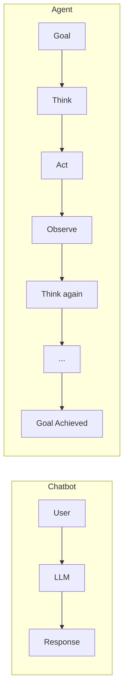

Chatbot 是单轮的输入-输出映射；Agent 是一个**闭环控制系统**。它有目标、有状态、有工具、有记忆，能在多步推理中不断缩小"当前状态"与"目标状态"的差距。

这个区别决定了 Agent 设计的核心矛盾：

> **LLM 是非确定性的，但生产系统需要确定性。**

Agent 设计的本质，就是在这两者之间建立一层"确定性外壳"——用状态机约束流程、用工具注册表约束能力、用风险策略约束行为、用审计日志约束可追溯性。

### 2.2 Agent 的四个核心能力

从众多 Agent 框架和论文中提炼，一个生产级 Agent 至少需要四个核心能力：

| 能力 | 含义 | GoOnCall 中的体现 |
|---|---|---|
| **推理（Reasoning）** | 理解目标、制定计划、分析证据 | Eino ReAct 循环诊断 Incident |
| **行动（Action）** | 通过工具与外部世界交互 | Prometheus 查询、RabbitMQ 检查、Worker 重启 |
| **记忆（Memory）** | 保存和检索历史经验 | RAG 知识库 + PostgreSQL 持久化 |
| **安全（Safety）** | 约束行为边界、防止失控 | 风险策略 + HITL 审批 + 状态机 |

这四个能力不是独立的模块，而是相互交织的设计约束。后续章节逐一展开。

---

## 3. 设计哲学：五条原则

在动手写代码之前，先确立设计原则。这些原则来自对 Agent 安全问题的反思，也来自实际踩坑的经验。

### 3.1 Agent 决策，系统执行

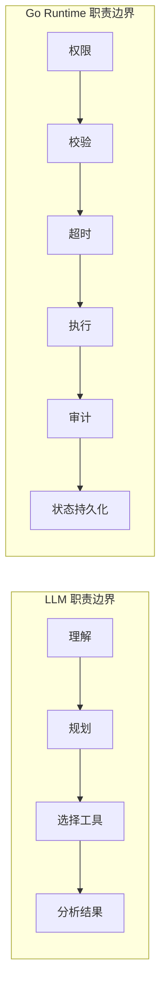

**永远不要让 LLM 直接获得数据库、Shell、Kubernetes 等底层权限。** LLM 说"重启 Worker"，它不应该有能力执行 `kubectl rollout restart`；它应该生成一个结构化的 Action 请求，由 Go Runtime 经过策略检查、审批流程后才真正执行。

这是整个系统安全的基石。

### 3.2 读与写分离

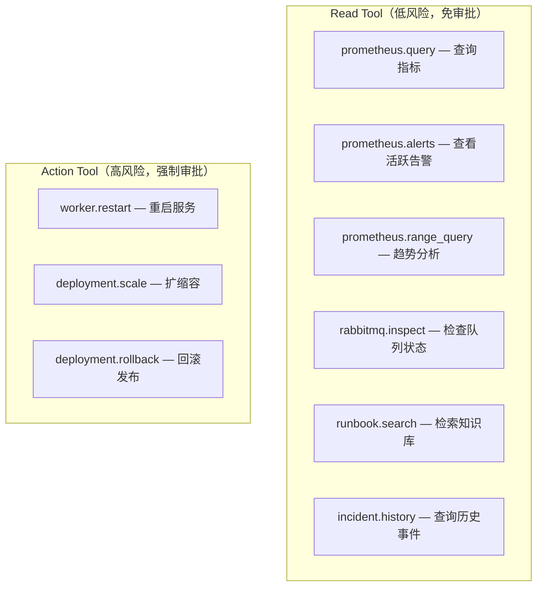

读操作是幂等的、无副作用的，Agent 可以自由调用以收集证据。写操作必须经过风险策略引擎评估，MEDIUM 及以上风险必须进入人工审批。

这个分离不是技术限制，而是**信任模型**：Agent 在诊断阶段应该尽可能多地收集证据（自由调用读工具），但在处置阶段必须受到约束（写工具需要审批）。

### 3.3 默认安全

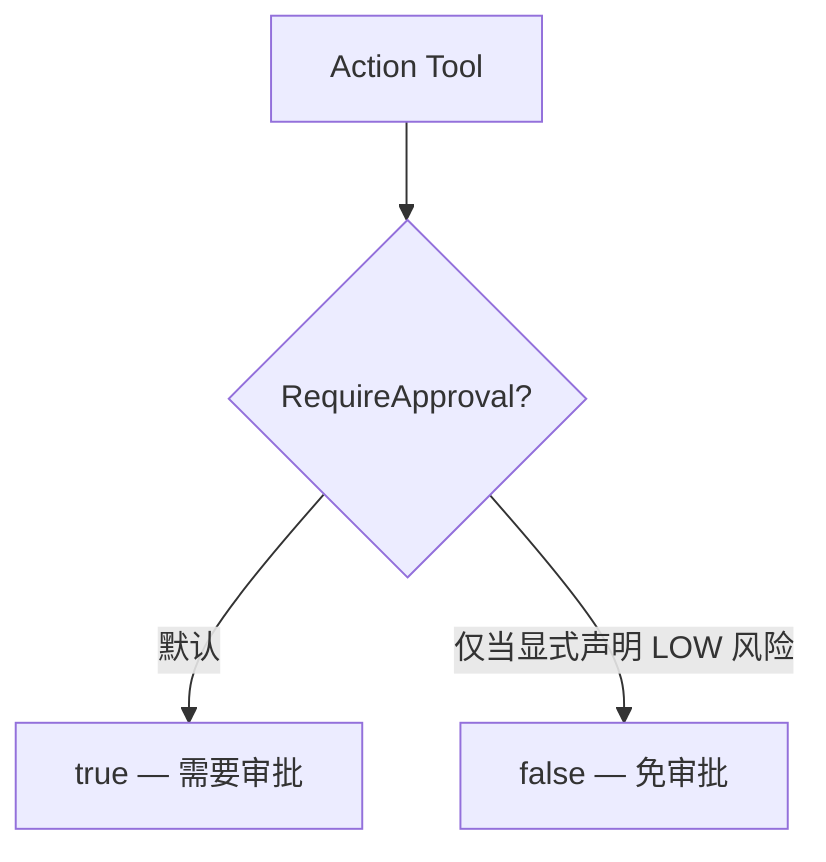

只有 LOW 风险、明确白名单的操作可以免审批。新增一个 Action Tool 时，它默认就是需要审批的——开发者必须显式声明"这个操作风险为 LOW"才能跳过审批。

这是安全工程中的"fail-safe defaults"原则在 Agent 系统中的应用。

### 3.4 可解释

每个结论都必须绑定证据（Evidence）：

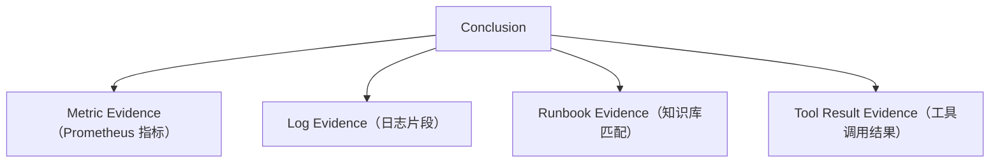

Agent 不应该"猜测"根因，而应该"基于证据推导"根因。这不仅是工程要求，也是 Prompt 设计的核心约束——在 System Prompt 中明确告诉 LLM："如果证据不足，继续调查，不允许猜测。"

### 3.5 可恢复

Agent 运行可能因为任何原因中断——LLM 超时、工具调用失败、等待人工审批。系统必须支持：

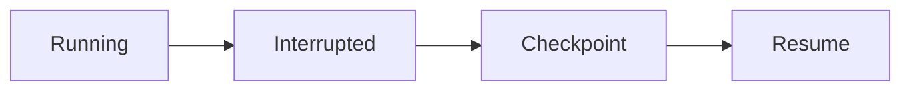

这不是可选的增强功能，而是生产系统的基本要求。在 GoOnCall 中，Agent Run 的每一步都持久化到 PostgreSQL，审批等待本质上就是一个 Checkpoint，审批通过后从 Checkpoint 恢复执行。

---

## 4. 架构全景

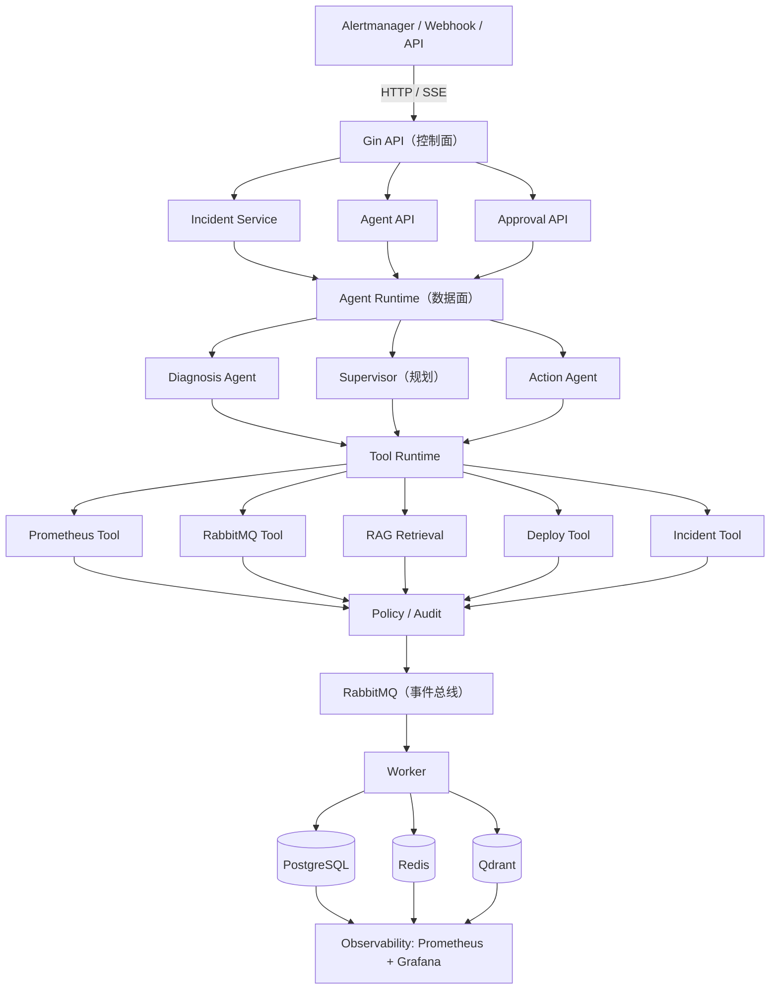

### 4.1 控制面与数据面分离

这是整个架构最重要的设计决策：

- **控制面（API Server）**：接收请求、管理状态、提供 SSE 流。它是确定性的、无状态的 HTTP 服务。
- **数据面（Agent Runtime / Worker）**：执行推理、调用工具、生成结论。它是非确定性的、有状态的。

两者通过消息队列（RabbitMQ）解耦。API 收到告警后发布 `agent.requested` 事件，Worker 消费事件后运行 Agent。这意味着：

- Agent 崩溃不影响 API 可用性
- Agent 可以独立扩缩容
- 消息队列天然提供重试和背压

### 4.2 两个进程，一套装配

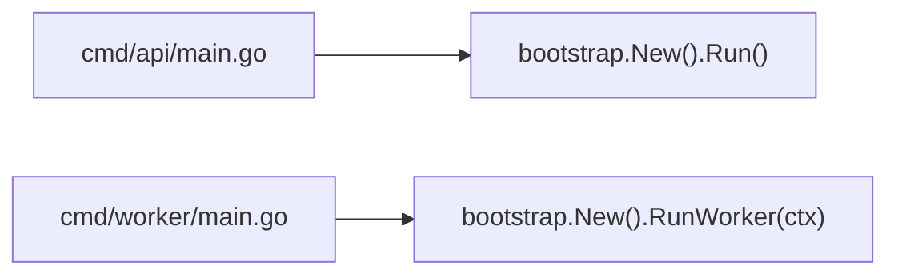

API 和 Worker 共享同一个 `bootstrap` 包做依赖注入，但启动不同的组件。这避免了代码重复，也保证了两者对领域模型的理解完全一致。

### 4.3 优雅降级

每个外部依赖都有降级方案：

| 依赖缺失 | 降级行为 |
|---|---|
| 无 PostgreSQL | 回退内存仓库 |
| 无 LLM | Agent 为 nil，analyze 仅做状态流转 |
| 无 RabbitMQ | 发布禁用，事件不投递 |
| 无 Qdrant | 回退内存向量存储 |
| RAG 索引失败 | 降级为词法检索 |

生产系统不能因为一个依赖不可用就整体不可用。优雅降级不是"容错"，而是"在不同资源条件下都能提供最大可用服务"。

---

## 5. ReAct 循环：Agent 的心脏

### 5.1 为什么是 ReAct

Agent 的推理模式有多种：Plan-then-Execute、Reflexion、LATS、ReAct。GoOnCall 选择 ReAct（Reasoning + Acting），原因是：

1. **动态性**：故障诊断不是预定义流程，Agent 需要根据每一步的结果决定下一步做什么
2. **可解释性**：每一步都有明确的 Thought → Action → Observation，便于审计
3. **工具友好**：ReAct 天然围绕"选择工具 → 执行 → 观察结果"设计，与工具系统无缝衔接

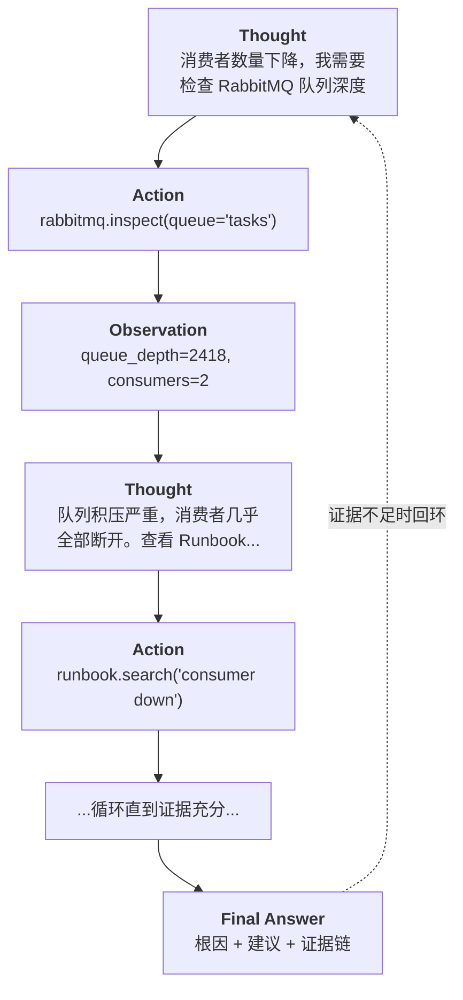

### 5.2 ReAct 在 Go 中的实现

GoOnCall 使用 CloudWeGo Eino 框架的 `react.NewAgent` 实现 ReAct 循环。关键设计：

```go
// 构建阶段：工具必须在 Build 时绑定（而非 Generate 时）
agent, err := react.NewAgent(ctx, &react.AgentConfig{
    Model:       chatModel,
    MaxStep:     maxSteps,       // 最大推理步数，防止无限循环
    ToolsConfig: toolsConfig,    // 工具定义，会注入到 LLM 请求中
})

// 执行阶段：传入消息，触发 ReAct 循环
result, err := agent.Generate(ctx, messages)
```

**工具必须在 Build 时绑定**——这是一个容易踩的坑。如果只在 Generate 时传入工具，LLM 的请求中不会包含工具定义（function calling schema），模型就不知道有哪些工具可用。

### 5.3 循环控制

ReAct 的危险在于无限循环。GoOnCall 设置了三重保护：

| 保护层 | 机制 | 默认值 |
|---|---|---|
| 步数上限 | `MaxStep` | 15 |
| 工具调用上限 | `maxToolCalls`（Recorder 层拦截） | 20 |
| 整轮超时 | `context.WithTimeout` | 180s |
| 单次工具超时 | 每个工具独立的 `context.WithTimeout` | 30s |

这四层保护从内到外，确保即使 LLM "陷入"循环，系统也能在有限时间内终止。

---

## 6. 工具系统：Agent 的手和眼

### 6.1 统一工具抽象

```go
type Tool interface {
    Name() string
    Description() string
    RiskLevel() string
    Execute(ctx context.Context, input json.RawMessage) (ToolResult, error)
}
```

所有工具——无论是查询 Prometheus 还是重启 Worker——都实现同一个接口。统一抽象带来两个好处：

1. **Registry 可以统一管理**：注册、查找、权限检查都在一层完成
2. **Agent 不关心工具的实现细节**：LLM 只看到工具名、描述和参数 schema

### 6.2 工具注册表

```go
type Registry struct {
    mu    sync.RWMutex
    tools map[string]RegisteredTool
}

type RegisteredTool struct {
    Tool      InvokableTool
    RiskLevel string   // LOW / MEDIUM / HIGH / CRITICAL
}
```

注册表是线程安全的，支持运行时查询。Agent 构建时从注册表取出所有工具，绑定到 ReAct Agent。

### 6.3 工具即装饰器

GoOnCall 使用装饰器模式为工具添加横切关注点：

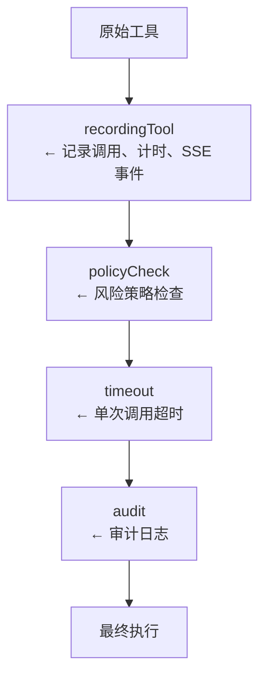

`recordingTool` 是一个典型例子——它包装原始工具，在调用前后记录 AgentStep 和 ToolCall，发布 SSE 事件，但完全不修改工具本身的逻辑。这是"关注点分离"在 Agent 工具系统中的体现。

### 6.4 Action Tool 的两阶段执行

Action Tool（如 `worker_restart`）有一个关键的设计：**LLM 调用时并不真正执行**。

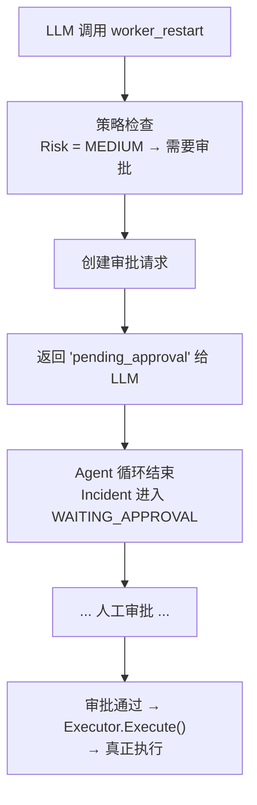

这个设计确保了 LLM 永远无法直接触发危险操作。LLM 的"调用"实际上只是"请求"，真正的执行权在审批链之后。

---

## 7. 状态机：确定性的骨架

### 7.1 为什么需要状态机

Agent 系统中最危险的事情是**状态混乱**——Incident 还在调查中就被标记为已解决，或者审批还没通过就开始执行。

GoOnCall 的答案是：**LLM 永远不能直接修改 Incident 状态**。状态转换由一个严格的 Go 状态机控制：

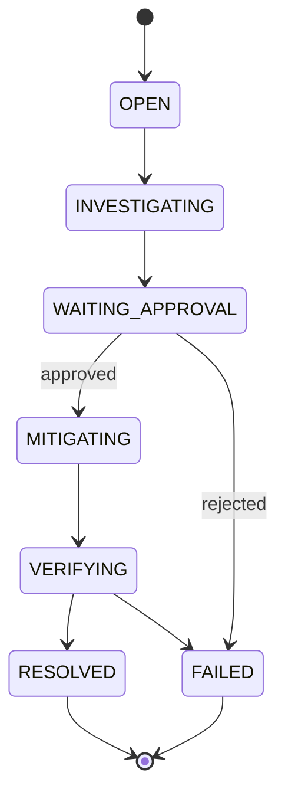

状态机用一张显式的转换表实现，任何不在表中的转换都会被拒绝。例如，`INVESTIGATING → RESOLVED` 是明确禁止的——必须经过审批、执行、验证才能关闭。

### 7.2 乐观锁保护并发

```sql
UPDATE incidents
SET status = $1, version = version + 1
WHERE id = $2 AND version = $3
```

两个 Worker 同时处理同一个 Incident 时，只有一个能成功更新（`RowsAffected == 1`），另一个会得到 `ErrConcurrentModification`（HTTP 409）。这比分布式锁更轻量，也足够安全。

### 7.3 状态机与 ReAct 的边界

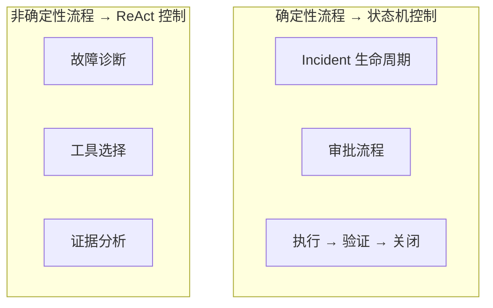

**不要让 LLM 决定所有流程。** 确定性的业务逻辑（状态转换、审批流程、执行验证）用 Go 代码硬编码；只有真正需要"智能判断"的部分（故障诊断、根因分析）才交给 ReAct 循环。

这是 Agent 系统最容易犯错的地方：把太多控制权交给 LLM，导致系统行为不可预测。

---

## 8. 事件驱动：解耦的艺术

### 8.1 为什么用消息队列

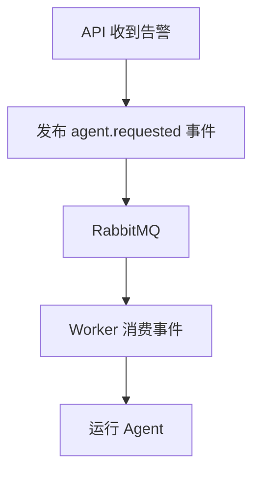

如果把 Agent 执行放在 HTTP 请求中，一个诊断可能需要 3 分钟——HTTP 连接早就超时了。消息队列解决了这个问题：

- API 快速响应（发布事件后立即返回）
- Worker 异步处理（不受 HTTP 超时限制）
- 天然支持重试（消费失败自动重新投递）
- 天然支持背压（队列堆积时 Worker 按自己的速度消费）

### 8.2 可靠投递

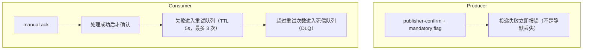

消息队列不是"发了就不管"。GoOnCall 确保每条消息都被可靠投递和处理：publisher confirm 保证消息到达 Exchange，mandatory flag 保证消息到达 Queue，manual ack 保证消息被成功处理。

### 8.3 事件协议

```text
Routing Keys:
  agent.requested       # 请求诊断
  incident.created      # Incident 创建
  action.requested      # 请求执行动作
  action.completed      # 动作执行完成
  approval.required     # 需要人工审批
```

事件协议是系统各部分的"契约"。API 和 Worker 通过事件协议通信，彼此不需要知道对方的实现细节。这也是为什么控制面和数据面可以独立部署和扩缩容。

---

## 9. RAG：Agent 的长期记忆

### 9.1 为什么 Agent 需要 RAG

LLM 的知识有两个缺陷：

1. **不知道你的系统**：它不知道你的 RabbitMQ 队列叫什么名字，不知道上次 Worker 挂掉是怎么修的
2. **会过时**：它不知道昨天的发布引入了什么 bug

RAG（Retrieval-Augmented Generation）通过检索本地知识库来弥补这两个缺陷。Agent 在诊断时可以搜索 Runbook、历史 Postmortem、架构文档，获取与当前故障相关的上下文。

### 9.2 混合检索架构

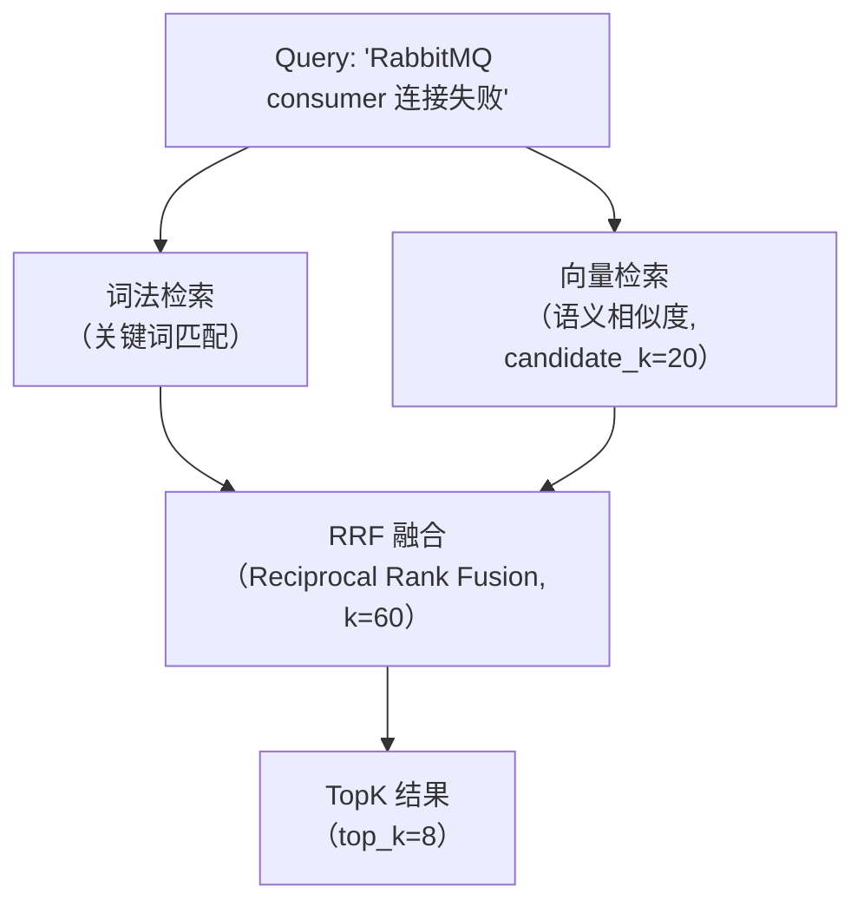

纯向量检索会漏掉精确关键词匹配（如特定的错误码）；纯词法检索无法理解语义相似性（"consumer 断开"和"消费者连接失败"）。混合检索结合两者的优势，用 RRF（Reciprocal Rank Fusion）融合排序。

### 9.3 增量索引

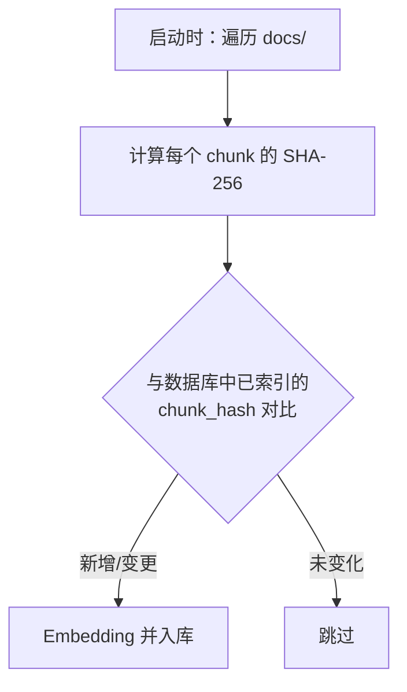

知识库不需要每次启动都全量重建。通过内容哈希实现增量索引，未变化的 chunk 直接跳过，节省 embedding API 调用成本和时间。

### 9.4 降级策略

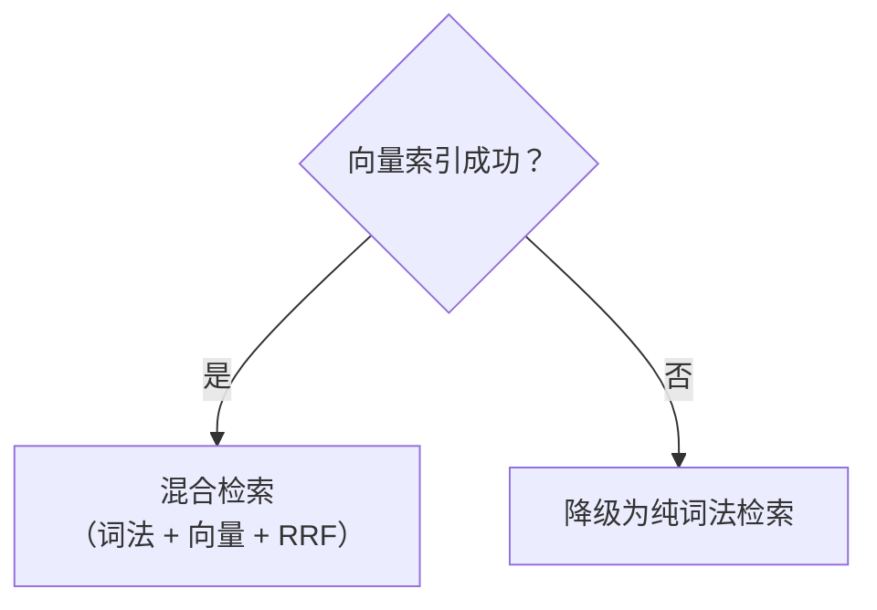

RAG 是增强功能，不是核心功能。即使向量库不可用，Agent 仍然可以通过词法检索获取知识——系统不会因为 RAG 失败而完全丧失诊断能力。

---

## 10. HITL：人在环审批

### 10.1 为什么需要人在环

完全自动化的 Agent 是危险的。LLM 可能：

- 基于不充分的证据做出错误判断
- 选择正确的工具但传入错误的参数
- 在"修复"问题时引入新的问题

人在环（Human-in-the-Loop）在关键决策点引入人类判断：

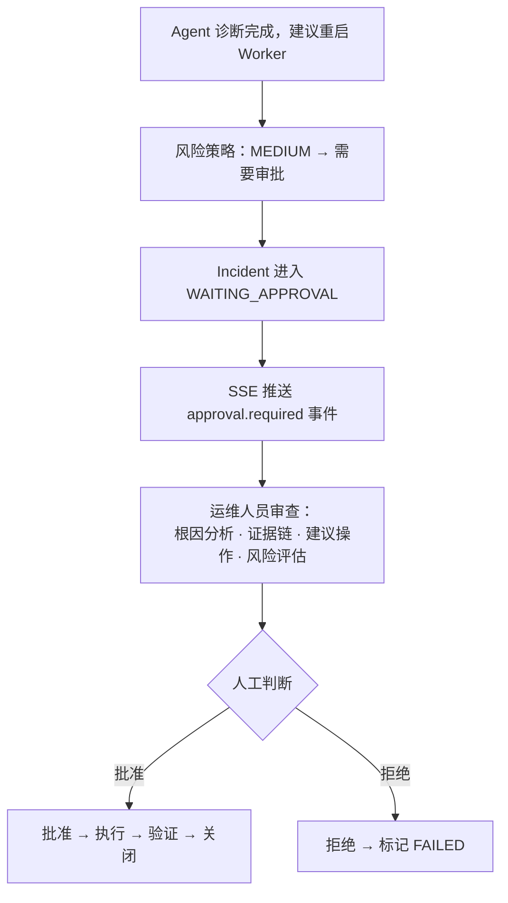

### 10.2 审批不是阻塞

审批等待期间，系统不是"卡住了"——而是进入了一个合法的中间状态。Agent Run 的当前状态被持久化，SSE 事件流通知前端展示审批卡片，运维人员可以在任何时候查看审批详情并做出决策。

审批通过后，系统从 Checkpoint 恢复执行：执行操作 → 验证指标 → 关闭 Incident → 生成 Postmortem。整个链路是自动的，只有"批准"这一步需要人。

### 10.3 完整审计链

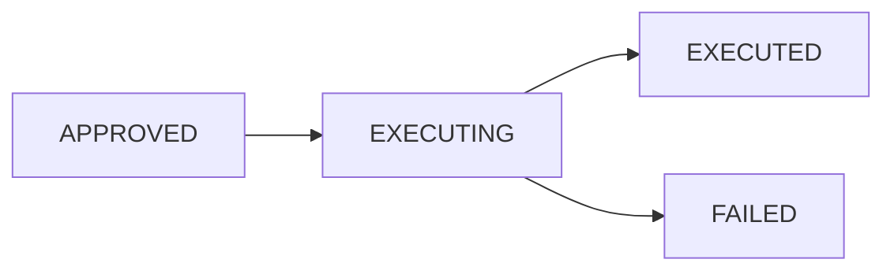

每一步状态转换都有时间戳、操作人、关联的 Run ID 和 Tool Call ID。这不仅是技术需求，也是合规需求——在生产环境中，你需要知道"谁在什么时候批准了什么操作"。

---

## 11. 可观测性：Agent 也需要被监控

### 11.1 Agent 的 Metrics

```text
gooncall_incidents_total          # Incident 创建总数
gooncall_agent_runs_total         # Agent 运行总数
gooncall_tool_calls_total         # 工具调用总数
gooncall_approval_total           # 审批总数
gooncall_webhook_total            # Webhook 处理总数
```

Agent 系统本身也需要被监控。这些指标暴露到 Prometheus，Grafana 自动加载预置面板，运维人员可以看到 Agent 的运行状况。

### 11.2 高基数陷阱

```text
推荐 Label:  service, agent_type, tool, status
禁止 Label:  incident_id, user_id, request_id
```

Prometheus 的 Label 组合决定了时间序列的数量。如果把 `incident_id` 作为 Label，每个 Incident 都会创建一组新的时间序列，导致 Prometheus 内存暴涨。高基数的标识符应该放在日志中，而不是 Metrics 中。

### 11.3 SSE 事件流

```text
event: run.started        data: {"run_id":"run_001"}
event: agent.thinking     data: {"agent":"diagnosis"}
event: tool.started       data: {"tool":"prometheus.query"}
event: tool.completed     data: {"tool":"prometheus.query","duration_ms":32}
event: approval.required  data: {"approval_id":"ap_001"}
event: done               data: {"run_id":"run_001"}
```

前端不需要理解 Agent 内部对象（Incident、AgentRun、ToolCall），只消费稳定的 SSE 事件协议。这是"控制面向前端暴露简洁协议"的体现。

---

## 12. Prompt 工程：约束即自由

### 12.1 System Prompt 的角色定义

```text
你负责故障定位，不负责生产环境修改。
每一个 Root Cause 判断必须至少关联一个 Evidence。
优先使用监控指标验证假设。
不能根据单条日志直接判定根因。
如果证据不足，继续调查，不允许猜测。
```

Agent 的 System Prompt 不是"请帮我诊断问题"这么简单。它需要明确定义：

1. **角色边界**：你能做什么，不能做什么
2. **证据要求**：结论必须有证据支撑
3. **行为约束**：不允许猜测，不允许跳过步骤
4. **工具偏好**：优先使用哪些工具

### 12.2 上下文注入

```mermaid
flowchart TD
    SP["System Prompt（静态）"] --> LLM["LLM Request"]
    IC["Incident Context（动态）"] --> LLM
```

System Prompt 是静态的 Markdown 文件，启动时加载。Incident 的具体信息（服务名、告警名、严重程度、描述）作为 User Message 动态注入。这种分离让 Prompt 可以独立于代码修改和版本管理。

---

## 13. 系列后续文章索引

本总纲勾勒了 Agent 设计的全景。每个子系统都值得深入探讨，后续文章将逐一展开：

| 篇目 | 核心内容 |
|---|---|
| **告警链路** | Alertmanager → Webhook → Incident 创建 → 指纹去重 → 告警复发重开 → 自动触发诊断 |
| **RAG 混合检索** | Loader → Splitter → Embedding → 向量库 → 词法 + 向量 RRF 融合 → 增量索引 → 降级策略 |
| **HITL 审批链** | 风险策略引擎 → 审批状态机 → Checkpoint/Resume → 审计链 → 执行验证闭环 |
| **工具运行时** | 统一接口 → 注册表 → 装饰器链 → 读/写分离 → Action 两阶段执行 → 超时与幂等 |
| **状态机设计** | 转换表 → 乐观锁 → 并发保护 → 与 ReAct 的边界 → 为什么 LLM 不能改状态 |
| **事件驱动架构** | RabbitMQ 可靠投递 → 重试队列 → DLQ → 事件协议 → 控制面/数据面解耦 |
| **Agent Runtime** | Eino ReAct 集成 → OpenAI 兼容模型 → Recorder → SSE Broker → 循环控制 |

---

## 14. 结语

Agent 不是"调大模型"，而是一个完整的系统工程问题。

```mermaid
flowchart LR
    A["Detect"] --> B["Understand"] --> C["Plan"] --> D["Investigate"] --> E["Approve"] --> F["Execute"] --> G["Verify"] --> H["Learn"]
    style B fill:#4a9,stroke:#333,color:#fff
    style C fill:#4a9,stroke:#333,color:#fff
    style D fill:#4a9,stroke:#333,color:#fff
    style A fill:#666,stroke:#333,color:#fff
    style E fill:#666,stroke:#333,color:#fff
    style F fill:#666,stroke:#333,color:#fff
    style G fill:#666,stroke:#333,color:#fff
    style H fill:#666,stroke:#333,color:#fff
```

> 绿色 = LLM 驱动阶段；灰色 = 工程系统驱动阶段。

这八个阶段中，LLM 只在 Understand、Plan、Investigate 三个阶段发挥作用。其余五个阶段——检测、审批、执行、验证、学习——都是确定性的 Go 代码在控制。

这就是 Agent 设计的核心思路：**让 LLM 做它擅长的事（推理、分析、决策），让工程系统做它擅长的事（状态管理、权限控制、可靠执行、审计追溯）。**

两者结合，才能构建出"可观测、可恢复、可审计"的生产级 Agent 系统。

---

> **参考资料**
>
> - [Go Agent 开发系列](https://golangstar.cn/go_agent_series/) — ReAct 循环、统一 Tool 抽象、记忆系统与 Agentic RAG、多智能体协作
> - [AI Agent 开发课程](https://liwenzhou.com/courses/ai-agent) — Agent 架构设计、上下文工程、Immutable 配置快照、Guard 安全护栏
> - [CloudWeGo Eino](https://github.com/cloudwego/eino) — Go 语言 Agent 框架
> - [GoOnCall-Agent](https://github.com/changhen2004/GoOnCall-Agent) — 本项目完整源码
