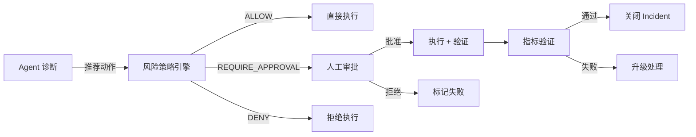
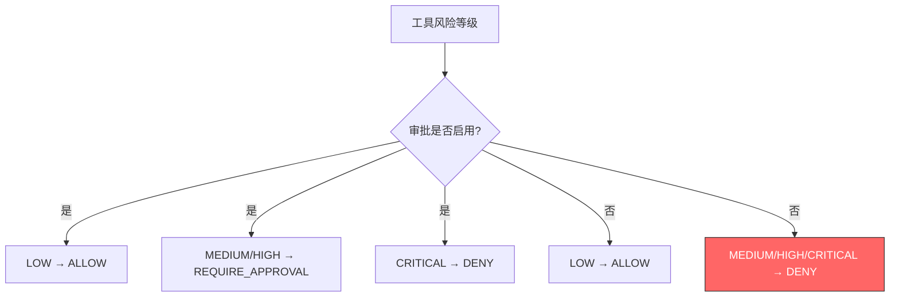
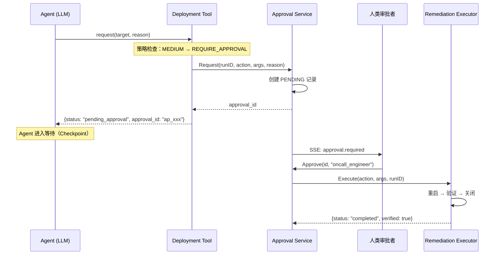
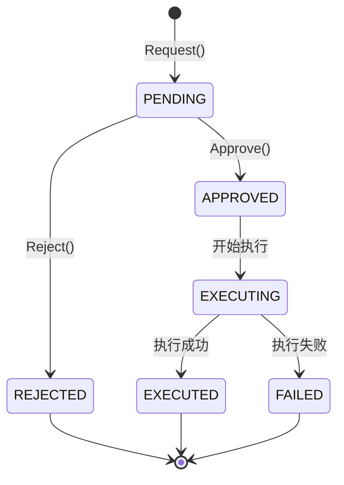
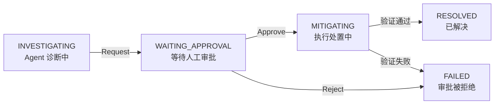
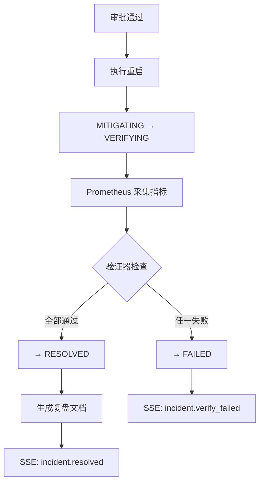
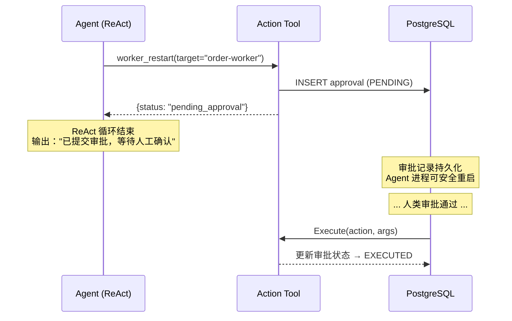

> 本文是「GoOnCall Agent 设计系列」的第四篇，聚焦 HITL（Human-In-The-Loop）审批链——从风险策略引擎到处置验证闭环的完整设计。
>
> 项目地址：[GoOnCall-Agent](https://github.com/changhen2004/GoOnCall-Agent)
>
> 前篇：[Go Agent 设计总纲——从 ReAct 循环到 AIOps 闭环]() | [告警链路]() | [RAG 混合检索]()

---

## 1. HITL 要解决什么问题

Agent 具备自动诊断能力后，下一个问题就是**自动处置**。但"自动"不等于"无人值守"——在运维场景中，一次错误的重启可能导致比原始故障更严重的后果。

因此我们需要一条审批链，在 Agent 与真实操作之间设置**人类决策关卡**：



这条链路需要解决几个核心问题：

- **风险分级**：不同操作的风险等级不同，策略应有所区分
- **两阶段执行**：Agent 调用工具时不立即执行，而是先创建审批请求
- **状态持久化**：审批等待期间系统可重启，状态不能丢
- **审计完整**：每一步状态迁移都要有时间戳和操作人记录
- **处置验证**：执行后不能假设成功，必须用指标验证

---

## 2. 风险策略引擎：四级决策

### 2.1 风险等级

每个工具在注册时声明风险等级（`internal/tool/registry/registry.go`）：

```go
// RiskLevel 表示工具操作的风险等级。
type RiskLevel string

const (
    RiskLow      RiskLevel = "LOW"       // 只读查询
    RiskMedium   RiskLevel = "MEDIUM"    // 重启 Worker
    RiskHigh     RiskLevel = "HIGH"      // 扩缩容
    RiskCritical RiskLevel = "CRITICAL"  // 数据库变更
)
```

### 2.2 决策矩阵

策略引擎根据风险等级和审批开关返回决策（`internal/execution/policy/policy.go`）：

```go
func (e *Engine) Evaluate(risk registry.RiskLevel) Decision {
    switch risk {
    case registry.RiskLow:
        return DecisionAllow
    case registry.RiskMedium, registry.RiskHigh:
        if e.approvalEnabled {
            return DecisionRequireApproval
        }
        return DecisionDeny
    case registry.RiskCritical:
        return DecisionDeny
    default:
        return DecisionDeny
    }
}
```

决策矩阵总结如下：

| 风险等级 | 审批已启用 | 审批未启用 | 设计考量 |
|---------|-----------|-----------|---------|
| LOW | ALLOW | ALLOW | 只读操作，无需审批 |
| MEDIUM | REQUIRE_APPROVAL | **DENY** | 重启等操作，fail-closed |
| HIGH | REQUIRE_APPROVAL | **DENY** | 扩缩容等操作，fail-closed |
| CRITICAL | DENY | DENY | v1.0 一律禁止 |

**关键设计决策**：当审批未启用时，MEDIUM/HIGH 操作不是降级为 ALLOW，而是直接 DENY。这是 **fail-closed** 原则——宁可不做，也不能在没有人类监督的情况下执行高风险操作。



---

## 3. 两阶段 Action Tool：请求与执行分离

### 3.1 核心思想

传统工具调用是同步的：Agent 调用 → 立即执行 → 返回结果。但在 HITL 场景中，我们需要将一次工具调用拆分为两个阶段：



**阶段一（request）**：Agent 调用工具时，工具并不执行实际操作，而是创建一条审批请求并返回 `pending_approval` 状态。Agent 的 ReAct 循环在此处"暂停"——这就是 **Checkpoint** 模式。

**阶段二（Execute）**：人类批准后，Approval Service 调用真正的执行器。此时 Agent 的 ReAct 循环可能已经结束，甚至进程可能已经重启过。

### 3.2 代码实现

以 `restart_worker` 工具为例（`internal/tool/deployment/restart_worker.go`）：

```go
// request 是 Agent 调用入口：发起审批，不直接执行。
func (t *Tool) request(ctx context.Context, in RestartInput) (RestartResult, error) {
    // 1. 策略检查
    if t.policy != nil && t.policy.Evaluate(registry.RiskMedium) == policy.DecisionDeny {
        return RestartResult{}, fmt.Errorf("worker.restart denied by policy")
    }

    // 2. 创建审批请求
    args, _ := json.Marshal(in)
    runID := agentruntime.RunIDFrom(ctx)
    a, err := t.approval.Request(ctx, runID, "", "restart_worker", string(args), in.Reason)
    if err != nil {
        return RestartResult{}, err
    }

    // 3. 返回 pending 状态，Agent 据此知道需要等待
    return RestartResult{
        Status:     "pending_approval",
        ApprovalID: a.ID,
        Target:     in.Target,
    }, nil
}

// Execute 执行重启动作（审批通过后由 ApprovalService 调用）。
func (t *Tool) Execute(_ context.Context, action, arguments string) (string, error) {
    var in RestartInput
    json.Unmarshal([]byte(arguments), &in)
    result := RestartResult{
        Status:  "completed",
        Target:  in.Target,
        Message: fmt.Sprintf("worker %s restarted", in.Target),
    }
    data, _ := json.Marshal(result)
    return string(data), nil
}
```

注意 `request` 和 `Execute` 是两个完全独立的方法：`request` 通过 Eino 工具框架暴露给 LLM，`Execute` 则实现 `ActionExecutor` 接口，由 Approval Service 在审批通过后调用。

---

## 4. 审批状态机：五态流转

### 4.1 状态图

Approval 记录有五个状态，形成严格的状态机（`internal/execution/approval/service.go`）：



每次状态迁移都伴随两个动作：

1. **持久化**：写入数据库，确保重启后状态不丢失
2. **SSE 事件**：通过 StreamBroker 推送给前端，实现实时通知

### 4.2 Request：创建审批

```go
func (s *Service) Request(ctx context.Context, runID, toolCallID, action, arguments, reason string) (*model.Approval, error) {
    a := &model.Approval{
        ID:         "ap_" + uuid.NewString(),
        RunID:      runID,
        ToolCallID: toolCallID,
        Action:     action,
        Arguments:  arguments,
        Reason:     reason,
        Status:     model.ApprovalPending,
        CreatedAt:  time.Now(),
    }
    if err := s.repo.Create(ctx, a); err != nil {
        return nil, err
    }
    metrics.ApprovalsTotal.WithLabelValues(a.Action, string(model.ApprovalPending)).Inc()

    // Incident 状态联动：INVESTIGATING → WAITING_APPROVAL
    s.moveIncident(ctx, runID, model.StatusWaitingApproval)

    // SSE 通知前端
    s.publish(a.RunID, "approval.required", map[string]any{
        "approval_id": a.ID, "action": a.Action,
    })
    return a, nil
}
```

**设计要点**：

- `Arguments` 在创建时就完整序列化存储，审批通过后直接反序列化传给执行器——这保证了"审批的内容"和"执行的内容"完全一致
- `moveIncident` 将 Incident 状态迁移到 `WAITING_APPROVAL`，前端可据此展示审批卡片

### 4.3 Approve：批准并执行

```go
func (s *Service) Approve(ctx context.Context, id, approvedBy string) (*model.Approval, error) {
    a, err := s.repo.Get(ctx, id)
    if err != nil { return nil, err }
    if a.Status != model.ApprovalPending { return nil, ErrNotPending }

    // 1. APPROVED：记录审批人与时间
    now := time.Now()
    a.Status = model.ApprovalApproved
    a.ApprovedBy = approvedBy
    a.ApprovedAt = &now
    s.repo.Update(ctx, a)
    s.moveIncident(ctx, a.RunID, model.StatusMitigating)
    s.publish(a.RunID, "action.approved", ...)

    // 2. EXECUTING：执行前先落库
    a.Status = model.ApprovalExecuting
    s.repo.Update(ctx, a)
    s.publish(a.RunID, "action.executing", ...)

    // 3. 执行真实操作
    result, execErr := s.executor.Execute(ctx, a.Action, a.Arguments, a.RunID)

    // 4. 终态：EXECUTED 或 FAILED
    if execErr != nil {
        a.Status = model.ApprovalFailed
    } else {
        a.Status = model.ApprovalExecuted
    }
    s.repo.Update(ctx, a)
    s.publish(a.RunID, "action.completed", ...)
    return a, nil
}
```

**为什么 EXECUTING 要先落库？** 如果执行过程中进程崩溃，审批记录会停留在 `EXECUTING` 状态而非 `APPROVED`，运维人员可以据此判断"审批已通过且执行开始了，但中途失败"，而不是"审批还没处理"。这对故障排查至关重要。

### 4.4 审计链完整性

一次完整审批的审计记录：

| 时间戳 | 状态 | 操作人 | SSE 事件 |
|--------|------|--------|----------|
| T1 | PENDING | — | `approval.required` |
| T2 | APPROVED | `oncall_engineer` | `action.approved` |
| T3 | EXECUTING | — | `action.executing` |
| T4 | EXECUTED | — | `action.completed` (status=COMPLETED) |

每个状态迁移都有 Prometheus 指标计数器：

```go
metrics.ApprovalsTotal.WithLabelValues(a.Action, string(model.ApprovalExecuted)).Inc()
```

可以在 Grafana 中按 `action` 和 `status` 维度监控审批吞吐量和失败率。

---

## 5. Incident 状态联动

审批链不是孤立的——它与 Incident 状态机紧密联动。`moveIncident` 辅助方法通过 `runID` 找到关联的 Incident 并迁移状态：

```go
func (s *Service) moveIncident(ctx context.Context, runID string, next model.Status) {
    if s.incidentSvc == nil || s.runRepo == nil || runID == "" {
        return  // 未配置时静默跳过，允许审批链独立运行
    }
    run, err := s.runRepo.GetRun(ctx, runID)
    if err != nil { return }
    _, _ = s.incidentSvc.MoveTo(ctx, run.IncidentID, next)
}
```

完整的 Incident 状态联动：



**设计决策**：使用 `WithIncidentState` 可选注入而非构造器必传参数，使得审批服务可以在没有 Incident 管理的环境中独立使用（例如纯测试场景）。

---

## 6. 处置闭环：执行 → 验证 → 复盘

审批通过后的执行不是简单的"调 API 然后返回"，而是一个完整的 **处置闭环**（`internal/execution/executor/remediation.go`）：



### 6.1 Remediation Executor

```go
func (r *Remediation) Execute(ctx context.Context, action, arguments, runID string) (string, error) {
    // 1. 执行重启
    r.restart.Execute(ctx, action, arguments)

    // 2. 根据 runID 定位 Incident
    incidentID := ""
    if run, err := r.runRepo.GetRun(ctx, runID); err == nil {
        incidentID = run.IncidentID
    }

    // 3. MITIGATING → VERIFYING
    r.incidentSvc.MoveTo(ctx, incidentID, model.StatusVerifying)

    // 4. 采集指标 + 验证
    metrics := r.gatherer.Gather(ctx, incidentID)
    result := r.verifier.Verify(metrics)

    // 5. 验证通过 → RESOLVED + 复盘；失败 → FAILED
    if result.Passed {
        r.incidentSvc.MoveTo(ctx, incidentID, model.StatusResolved)
        res.Postmortem = r.postmortem.Generate(resolved, ...)
    } else {
        r.incidentSvc.MoveTo(ctx, incidentID, model.StatusFailed)
    }
    // ...
}
```

### 6.2 三指标验证器

验证器检查三个维度的指标是否恢复到正常范围（`internal/execution/verifier/verifier.go`）：

```go
func (v *Verifier) Verify(m Metrics) Result {
    checks := []Check{
        {
            Name:   "consumer_count",
            Passed: m.ConsumerCount >= v.cfg.MinConsumers,
            Detail: fmt.Sprintf("consumers=%d (min=%d)", m.ConsumerCount, v.cfg.MinConsumers),
        },
        {
            Name:   "queue_depth",
            Passed: m.QueueDepth <= v.cfg.MaxQueueDepth,
            Detail: fmt.Sprintf("queue_depth=%d (max=%d)", m.QueueDepth, v.cfg.MaxQueueDepth),
        },
        {
            Name:   "error_rate",
            Passed: m.ErrorRate <= v.cfg.MaxErrorRate,
            Detail: fmt.Sprintf("error_rate=%.4f (max=%.4f)", m.ErrorRate, v.cfg.MaxErrorRate),
        },
    }
    // 全部通过才算验证通过
}
```

| 指标 | 含义 | 默认阈值 | 为什么选它 |
|------|------|---------|-----------|
| `consumer_count` | RabbitMQ 消费者数 | ≥ 1 | 重启后 Worker 必须重新注册消费 |
| `queue_depth` | 队列积压消息数 | ≤ 1000 | 积压下降说明消费恢复正常 |
| `error_rate` | HTTP 5xx 错误率 | ≤ 1% | 最终用户体验指标 |

### 6.3 指标采集：Prometheus 即时查询

验证器不关心指标从哪来，它只接收一个 `Metrics` 结构体。指标采集由 `MetricGatherer` 接口负责（`internal/execution/verifier/gatherer.go`）：

```go
type MetricGatherer interface {
    Gather(ctx context.Context, incidentID string) (Metrics, error)
}
```

生产环境使用 `PrometheusGatherer`，通过 PromQL 即时查询获取实时指标：

```go
// DefaultQueries 默认 PromQL
Queries{
    Consumers:  "sum(rabbitmq_queue_consumers)",
    QueueDepth: "sum(rabbitmq_queue_messages_ready)",
    ErrorRate:  `sum(rate(http_requests_total{status=~"5.."}[1m])) 
                 / clamp_min(sum(rate(http_requests_total[1m])), 0.001)`,
}
```

PromQL 通过配置注入，可以适配不同业务系统的指标命名。本地 Demo 则使用 `MockGatherer` 返回预置的"已恢复"指标。

### 6.4 自动复盘

验证通过后，`postmortem.Generator` 自动生成 Markdown 格式的复盘文档：

```markdown
# Incident INC-xxx

## Summary
Worker 消费者掉线导致消息积压

## Root Cause
worker restart 后指标恢复

## Evidence
- consumers=5 (min=1)
- queue_depth=100 (max=1000)
- error_rate=0.0010 (max=0.0100)

## Resolution
restart worker

## Prevention
- 增加相关指标告警
- 增加 readiness 检查
- 处置后增加自动验证
```

复盘文档的每个字段都来自真实数据：Incident 标题、验证器输出的具体指标值、处置动作名称。不是模板占位符，而是可审计的记录。

---

## 7. Checkpoint/Resume 模式

### 7.1 为什么需要 Checkpoint

Agent 的 ReAct 循环是同步的：LLM 调用工具 → 拿到结果 → 继续推理。但审批可能需要几分钟甚至几小时。我们不能让 ReAct 循环一直阻塞等待。

解决方案是 **Checkpoint/Resume**：



Agent 在收到 `pending_approval` 后正常结束 ReAct 循环，告知用户"已提交审批"。审批记录完整持久化在数据库中。当人类审批通过时，Approval Service 独立于 Agent 运行执行器。

### 7.2 与 Agent Run 的关系

```
Agent Run (诊断阶段)          审批等待期           执行阶段
┌──────────────────┐    ┌──────────────┐    ┌──────────────────┐
│ ReAct 循环        │    │              │    │ Remediation      │
│  → 分析告警       │    │  PENDING     │    │  → 重启 Worker    │
│  → 查询指标       │    │  (人类审批)   │    │  → 采集指标       │
│  → 调用工具       │───→│              │───→│  → 验证           │
│  → 返回 pending  │    │              │    │  → 生成复盘       │
└──────────────────┘    └──────────────┘    └──────────────────┘
     有 runID               通过 runID 关联       使用 runID
```

`runID` 是贯穿整个流程的关联键：Agent Run 创建时生成，审批请求中携带，执行器通过它找到对应的 Incident。

---

## 8. 设计决策总结

| 决策 | 选择 | 替代方案 | 理由 |
|------|------|---------|------|
| 风险策略 | fail-closed | fail-open | 运维操作失败代价极高，宁可不做 |
| 执行分离 | 两阶段方法 | 阻塞等待 | 审批可能耗时数小时，不应阻塞 Agent |
| 状态持久化 | 每次迁移都落库 | 仅终态落库 | EXECUTING 中间态对故障排查至关重要 |
| 验证方式 | 指标即时查询 | 固定等待时间 | 基于真实数据判断，而非猜测 |
| 复盘生成 | 自动模板 | 人工编写 | 保证每个关闭的 Incident 都有复盘记录 |
| Incident 联动 | 可选注入 | 强耦合 | 允许审批链独立测试和使用 |
| CRITICAL 操作 | 一律 DENY | 需更高级审批 | v1.0 不支持，留待后续版本 |

---

## 9. 与总纲的对应

回到[设计总纲]()中的 Agent 架构全景：

- **工具层**：Action Tool 的两阶段设计让标准 Tool 接口具备了 HITL 能力，LLM 无需感知审批流程
- **处置层**：Remediation Executor 实现了总纲中"执行 → 验证 → 关闭"的闭环承诺
- **可观测性**：每次状态迁移都有 Prometheus 指标 + SSE 事件，与总纲的观测体系一脉相承
- **安全边界**：风险策略引擎是总纲中"Agent 不能做什么"的具体实现

与前三篇的关系：

- [告警链路]()：告警触发 Incident，Incident 驱动 Agent 诊断
- Agent 诊断中调用 Action Tool → 进入本文的审批链
- [RAG 混合检索]()：Agent 诊断时通过 RAG 获取知识库证据
- 审批通过后 → 本文的处置闭环完成整个生命周期

---

## 10. 参考

- [Eino Agent 框架](https://github.com/cloudwego/eino) — 字节跳动开源 Agent 框架
- [golangstar.cn Go Agent 系列](https://golangstar.cn) — Go Agent 设计模式讲解
- [liwenzhou.com AI Agent 课程](https://liwenzhou.com) — AI Agent 实战教程
- [Human-in-the-Loop 最佳实践](https://docs.anthropic.com/en/docs/build-with-claude/agentic-tool-use) — Anthropic Agent 设计指南
- 项目代码：[policy](https://github.com/changhen2004/GoOnCall-Agent/tree/main/internal/execution/policy) | [approval](https://github.com/changhen2004/GoOnCall-Agent/tree/main/internal/execution/approval) | [executor](https://github.com/changhen2004/GoOnCall-Agent/tree/main/internal/execution/executor) | [verifier](https://github.com/changhen2004/GoOnCall-Agent/tree/main/internal/execution/verifier)
