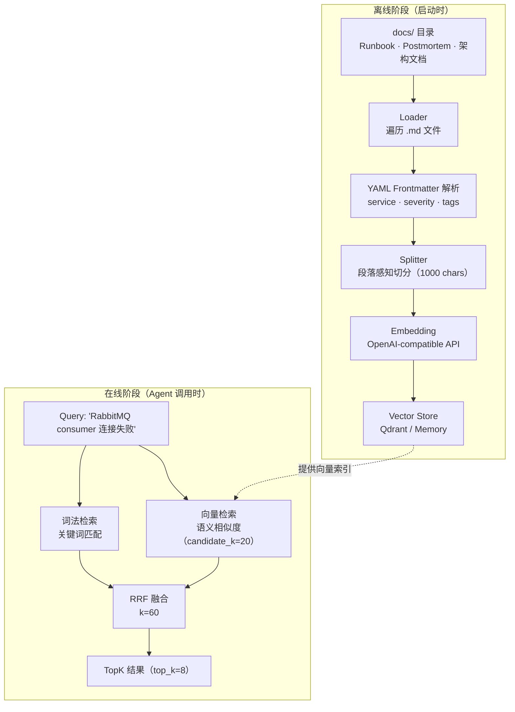
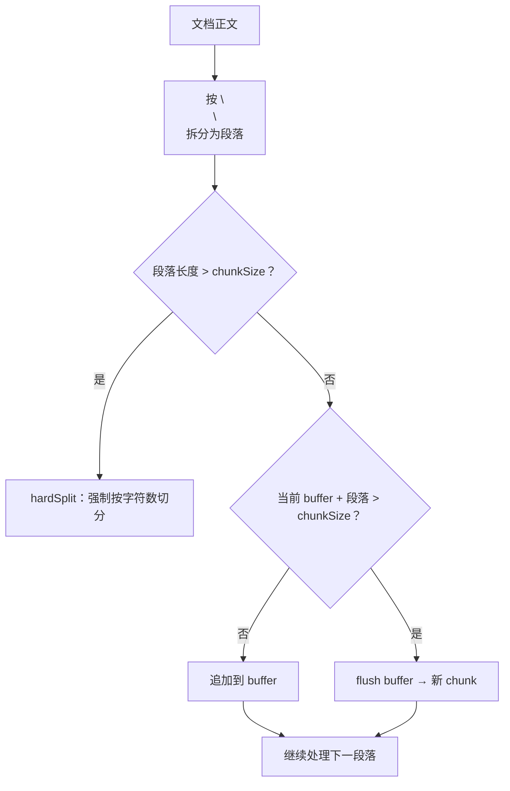
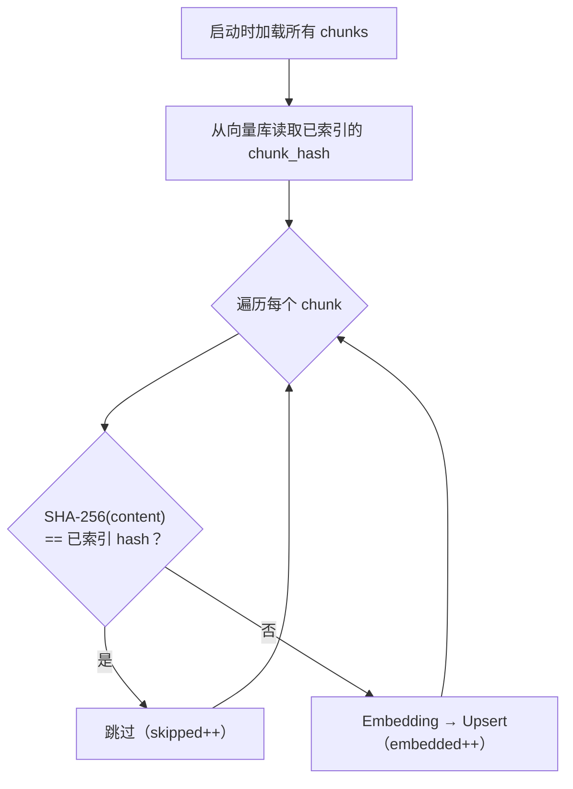
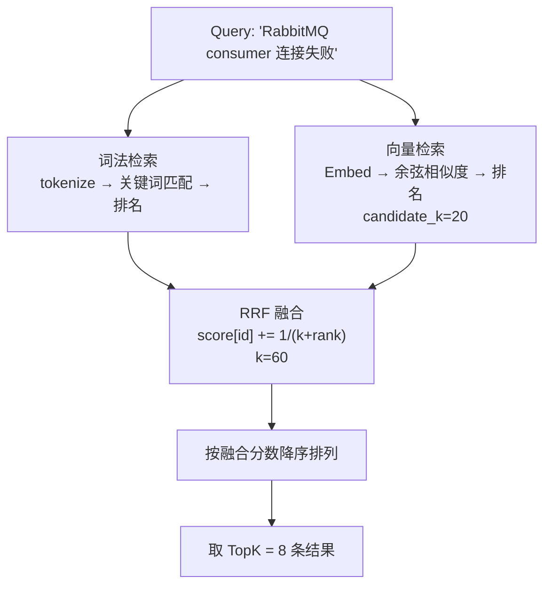
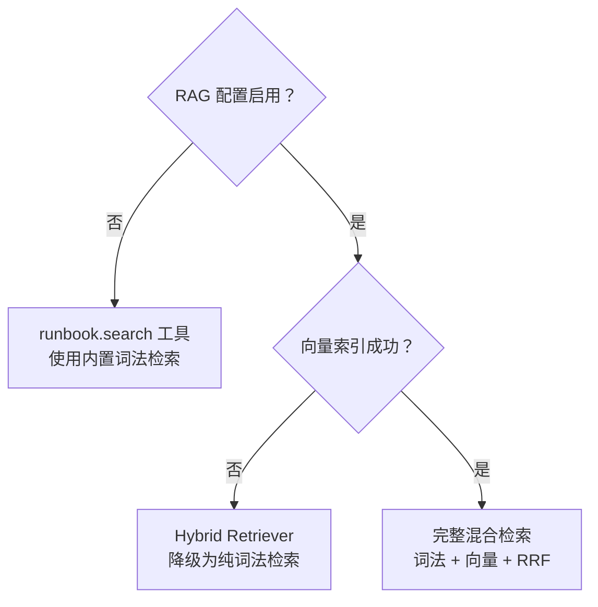

> 本文是「GoOnCall Agent 设计系列」的第三篇，聚焦 RAG（Retrieval-Augmented Generation）混合检索——Agent 如何从本地知识库中获取"长期记忆"。
>
> 项目地址：[GoOnCall-Agent](https://github.com/changhen2004/GoOnCall-Agent)
>
> 前篇：[告警链路——从 Alertmanager 到 Agent 诊断]()

---

## 1. 为什么 Agent 需要 RAG

LLM 的知识有两个致命缺陷：

1. **不知道你的系统**：它不知道你的 RabbitMQ 队列名叫 `tasks`，不知道上次 Worker 挂掉是因为消费者连接数耗尽
2. **会过时**：它不知道昨天的发布引入了什么 bug，不知道上周刚改过的配置

在 AIOps 场景中，这两个缺陷意味着 LLM 无法做出准确的诊断。它可能会给出"建议检查日志"这种正确但无用的建议，而不是"根据 Runbook，`tasks` 队列消费者断连通常是 RabbitMQ `channel_max` 达到上限，建议执行 `rabbitmqctl list_channels` 检查"。

RAG（Retrieval-Augmented Generation）通过检索本地知识库来弥补这两个缺陷。Agent 在诊断时调用 `runbook.search` 工具，从 Runbook、历史 Postmortem、架构文档中获取与当前故障相关的上下文，作为证据（Evidence）附在诊断结论中。

---

## 2. 知识管道全景



整个知识管道分为两个阶段：

- **离线阶段**：启动时加载文档、切分、embedding、写入向量库
- **在线阶段**：Agent 调用 `runbook.search` 时，执行混合检索并返回结果

---

## 3. Loader：从文件到知识片段

### 3.1 文档加载

Loader 递归遍历 `docs/` 目录，加载所有 `.md` 文件：

```go
// internal/knowledge/loader/loader.go
func (l *Loader) Load(_ context.Context) ([]*kmodel.Chunk, error) {
    chunks := make([]*kmodel.Chunk, 0)
    err := filepath.WalkDir(l.docsDir, func(path string, d fs.DirEntry, err error) error {
        if d.IsDir() || !strings.HasSuffix(path, ".md") {
            return nil
        }

        rel, _ := filepath.Rel(l.docsDir, path)
        docType := docTypeFromPath(rel)  // runbook / postmortem / architecture
        source := filepath.Base(path)

        content, _ := os.ReadFile(path)
        fm, body := parseFrontmatter(string(content))

        for i, piece := range l.splitter.Split(body) {
            chunks = append(chunks, &kmodel.Chunk{
                ID:       fmt.Sprintf("%s#%d", source, i),
                Source:   source,
                DocType:  docType,
                Service:  fm.Service,
                Title:    fm.Title,
                Content:  piece,
                Severity: fm.Severity,
                Tags:     fm.Tags,
            })
        }
        return nil
    })
    return chunks, err
}
```

几个设计要点：

- **文档类型推导**：根据文件在 `docs/` 下的子目录路径推导——`docs/runbooks/` 下的文件是 runbook，`docs/postmortems/` 下的是 postmortem。这让 Agent 可以按文档类型过滤检索结果
- **YAML Frontmatter**：支持文档头部的元数据（service、severity、tags），让检索结果携带结构化上下文
- **Chunk ID 格式**：`filename#index`，如 `rabbitmq-consumer-down.md#0`，便于溯源

### 3.2 Frontmatter 解析

```go
type frontmatter struct {
    Service  string   `yaml:"service"`
    Severity string   `yaml:"severity"`
    Title    string   `yaml:"title"`
    Tags     []string `yaml:"tags"`
}
```

一个典型的 Runbook 文件：

```markdown
---
service: rabbitmq
severity: high
title: RabbitMQ 消费者断连处理
tags: ["rabbitmq", "consumer", "connection"]
---

## 症状
消费者数量骤降为 0，队列积压持续增长...

## 排查步骤
1. 检查 RabbitMQ 连接状态...
2. 检查 channel_max 配置...
```

这些元数据不仅帮助 Loader 组织知识，也在检索时提供额外的过滤维度。

---

## 4. Splitter：段落感知切分

### 4.1 为什么不能简单按字符数切

最简单的切分方式是每 N 个字符切一刀，但这会破坏段落完整性——一段话可能被切成两半，前半段在 chunk A，后半段在 chunk B，导致 embedding 向量无法准确表达语义。

### 4.2 段落边界优先

GoOnCall 的 Splitter 优先在段落边界（`\n\n`）切分：

```go
// internal/knowledge/splitter/splitter.go
func (s *Splitter) Split(text string) []string {
    if len(text) <= s.chunkSize {
        return []string{text}
    }

    paras := splitParagraphs(text)  // strings.Split(text, "\n\n")
    var buf strings.Builder

    for _, p := range paras {
        if len(p) > s.chunkSize {
            // 超长段落：强制按字符数切分
            flush()
            chunks = append(chunks, hardSplit(p, s.chunkSize)...)
            continue
        }
        if buf.Len() > 0 && buf.Len()+2+len(p) > s.chunkSize {
            flush()  // 当前 buffer 加上下一个段落会超限，先刷出
        }
        buf.WriteString("\n\n")
        buf.WriteString(p)
    }
    flush()
    return chunks
}
```



默认 `chunkSize = 1000` 字符。这个大小在"语义完整性"和"检索精度"之间取得平衡：太小会丢失上下文，太大会引入噪声。

---

## 5. Embedding：文本到向量

### 5.1 OpenAI 兼容接口

Embedding 使用 OpenAI 兼容的 HTTP API（`POST /v1/embeddings`），这意味着可以对接 OpenAI、Azure OpenAI、或任何兼容接口（如本地的 Ollama）：

```go
// internal/knowledge/embedding/embedding.go
// POST /v1/embeddings
// Request:  {"model": "text-embedding-3-small", "input": ["chunk1", "chunk2"]}
// Response: {"data": [{"embedding": [0.1, 0.2, ...], "index": 0}, ...]}
```

默认使用 `text-embedding-3-small` 模型，输出 1536 维向量。

### 5.2 按原始顺序重排

API 返回的结果可能乱序，embedding 模块会按 `index` 字段重排，确保向量与输入 chunk 一一对应：

```go
vecs, err := h.embedder.Embed(ctx, []string{c.Content})
// vecs[0] 对应 chunks[0]，vecs[1] 对应 chunks[1]...
```

---

## 6. 向量存储：Qdrant 与内存双实现

### 6.1 统一接口

```go
// internal/knowledge/vectorstore/vectorstore.go
type VectorStore interface {
    Upsert(ctx context.Context, points []Point) error
    Search(ctx context.Context, query []float64, topK int) ([]SearchResult, error)
    Hashes(ctx context.Context) (map[string]string, error)  // chunk_id → chunk_hash
}
```

`Hashes` 方法是增量索引的关键——它返回已索引 chunk 的内容哈希，用于判断哪些 chunk 需要重新 embedding。

### 6.2 两个实现

| 实现 | 适用场景 | 特点 |
|---|---|---|
| **Memory** | 开发/测试、无 Qdrant 环境 | 暴力余弦相似度，无需外部依赖 |
| **Qdrant** | 生产环境 | gRPC 客户端，支持分页 Scroll 获取 Hashes |

Qdrant 实现中，chunk ID 需要转换为 UUID（Qdrant 要求 point ID 为 UUID 格式），使用 MD5 哈希生成确定性 UUID：

```go
// Qdrant point ID = MD5-based UUID from chunk ID
// 同一个 chunk ID 总是映射到同一个 UUID，支持 Upsert 覆盖
```

---

## 7. 增量索引：不重复 embedding

### 7.1 问题

每次启动都全量重新 embedding 所有文档是浪费的——大部分文档没有变化，embedding API 调用有成本（按 token 计费）和延迟。

### 7.2 基于内容哈希的增量索引

```go
// internal/knowledge/retriever/retriever.go
func (h *Hybrid) Index(ctx context.Context) error {
    // 1. 读取已索引 chunk 的内容哈希
    existing, _ := h.vector.Hashes(ctx)

    var embedded, skipped int
    for _, c := range h.chunks {
        hash := chunkHash(c)  // SHA-256(content)

        // 2. 哈希未变 → 跳过
        if existing[c.ID] == hash {
            skipped++
            continue
        }

        // 3. 新增/变更 → embedding + 写入
        vecs, _ := h.embedder.Embed(ctx, []string{c.Content})
        h.vector.Upsert(ctx, []vectorstore.Point{{
            ID:      c.ID,
            Vector:  vecs[0],
            Payload: map[string]any{"chunk_hash": hash},
        }})
        embedded++
    }
    slog.Info("knowledge index", "embedded", embedded, "skipped", skipped)
    return nil
}

func chunkHash(c *kmodel.Chunk) string {
    sum := sha256.Sum256([]byte(c.Content))
    return hex.EncodeToString(sum[:])
}
```



这个设计的好处：

- **零 API 调用浪费**：未变化的 chunk 不消耗 embedding 配额
- **启动更快**：100 个 chunk 中只有 3 个变化时，只需 3 次 API 调用
- **自动检测变更**：修改文档内容后，hash 自然不同，下次启动自动重新 embedding

---

## 8. 混合检索：词法 + 向量 + RRF 融合

### 8.1 为什么需要混合

纯向量检索和纯词法检索各有盲区：

| 场景 | 纯向量检索 | 纯词法检索 |
|---|---|---|
| "consumer 断开" vs "消费者连接失败" | 能匹配（语义相似） | 不能匹配（无共同关键词） |
| 错误码 `CHANNEL_ERROR 504` | 可能漏掉（特定错误码在向量空间中不突出） | 精确匹配 |
| 模糊描述 "队列堆积严重" | 能匹配相关文档 | 可能漏掉（没有精确关键词） |

混合检索结合两者优势：向量检索负责"语义相似"，词法检索负责"精确匹配"。

### 8.2 检索流程

```go
// internal/knowledge/retriever/retriever.go
func (h *Hybrid) Retrieve(ctx context.Context, query string, topK int) ([]Result, error) {
    // 1. 词法检索：关键词匹配，返回 1-based 排名
    ranks := make(map[string][]int)
    for id, r := range lexicalRanks(query, h.chunks) {
        ranks[id] = append(ranks[id], r)
    }

    // 2. 向量检索：语义相似度，返回 1-based 排名
    vr, _ := h.vectorRanks(ctx, query, h.candidateK)
    for id, r := range vr {
        ranks[id] = append(ranks[id], r)
    }

    // 3. RRF 融合
    scores := rrfScores(ranks, h.rrfK)

    // 4. 按融合分数降序排列，取 topK
    // ...
}
```



### 8.3 词法检索

```go
func lexicalRanks(query string, chunks []*kmodel.Chunk) map[string]int {
    tokens := tokenize(query)  // 分词、转小写、过滤 <2 字符的 token
    // 对每个 chunk 计算 token 命中率
    // 按命中率降序排列，转为 1-based 排名
}

func lexicalScore(tokens []string, content string) float64 {
    hits := 0
    for _, tok := range tokens {
        if strings.Contains(strings.ToLower(content), tok) {
            hits++
        }
    }
    return float64(hits) / float64(len(tokens))  // 命中率
}
```

词法检索的核心是**命中率**：query 中有多少比例的 token 在 chunk 中出现。简单但有效，特别是对错误码、服务名等精确标识符。

### 8.4 RRF 融合算法

Reciprocal Rank Fusion（RRF）是一种简单但鲁棒的排名融合算法：

```go
func rrfScores(ranks map[string][]int, k int) map[string]float64 {
    scores := make(map[string]float64)
    for id, rs := range ranks {
        for _, r := range rs {
            scores[id] += 1.0 / float64(k + r)
        }
    }
    return scores
}
```

公式：

$$\text{score}(id) = \sum_{\text{rank list}} \frac{1}{k + \text{rank}}$$

其中 `k = 60` 是常数，用于平滑排名差异。

RRF 的优势在于：

- **不需要归一化**：词法检索的"命中率"和向量检索的"余弦相似度"量纲不同，无法直接相加。RRF 只使用排名，不需要处理量纲问题
- **对异常值鲁棒**：一个检索方法给出的极端高分不会主导结果
- **实现简单**：几行代码就能完成融合

### 8.5 候选集优化

向量检索不是在全量 chunks 上做 topK，而是限制候选集大小为 `candidateK = 20`：

```go
func NewHybrid(chunks []*kmodel.Chunk, embedder embedding.Embedder,
    vector vectorstore.VectorStore, candidateK int) *Hybrid {
    if candidateK <= 0 {
        candidateK = 20
    }
    return &Hybrid{chunks: chunks, embedder: embedder, vector: vector,
        rrfK: 60, candidateK: candidateK}
}
```

这避免了每次查询都对全量 chunks 做向量搜索，在知识库规模增长时保持检索性能。

---

## 9. 三级降级策略

RAG 是增强功能，不是核心功能。即使 RAG 完全不可用，Agent 仍然应该能诊断问题（只是少了知识库的辅助）。GoOnCall 实现了三级降级：



### 9.1 配置级降级

如果配置中禁用了 RAG（无 embedding API key、无 Qdrant 地址），`buildRetriever` 返回 nil，工具层自行处理：

```go
// internal/tool/runbook/runbook.go
// retriever == nil → 使用内置的简单词法检索
// retriever != nil → 使用混合检索
```

### 9.2 索引级降级

如果 embedding 或向量库在索引阶段失败，`Index()` 返回错误，但系统不会崩溃——检索器仍然可以用已有的数据（或空数据）运行。

### 9.3 工具级降级

`runbook.search` 工具在 `retriever == nil` 时，退化为一个自包含的词法检索器，直接遍历 `docs/` 目录做关键词匹配：

```text
retriever != nil → 调用 retriever.Retrieve()（混合检索）
retriever == nil → 遍历 docs/*.md → 关键词匹配 → 返回结果
```

这确保了 Agent 在任何环境下都至少有基本的知识检索能力。

---

## 10. 从检索到证据

检索结果不是直接塞给 LLM，而是转化为结构化的 Evidence（证据），附在 Agent Run 的记录中：

```go
// internal/knowledge/retriever/retriever.go
func (r Result) ToEvidence(runID string) *incidentmodel.Evidence {
    return &incidentmodel.Evidence{
        ID:       "ev_" + uuid.NewString(),
        RunID:    runID,
        Type:     incidentmodel.EvidenceRunbook,
        Source:   r.Chunk.Source,
        Content:  r.Chunk.Content,
        Metadata: map[string]any{
            "doc_type": r.Chunk.DocType,
            "title":    r.Chunk.Title,
            "score":    r.Score,
        },
    }
}
```

这个设计呼应了总纲中的"可解释"原则——每个结论都必须绑定证据。Agent 说"根因是消费者断连"，这个结论必须关联到具体的 Runbook 片段（`Source: rabbitmq-consumer-down.md`），运维人员可以点击溯源。

---

## 11. 设计总结

### 11.1 关键设计决策

| 决策 | 原因 |
|---|---|
| 段落感知切分（非固定字符数） | 保持语义完整性，避免段落被截断 |
| SHA-256 内容哈希增量索引 | 节省 embedding API 成本，加速启动 |
| 词法 + 向量混合检索 | 兼顾精确匹配和语义理解 |
| RRF 融合（k=60） | 无需归一化，对异常值鲁棒 |
| 候选集限制（candidateK=20） | 控制向量检索延迟 |
| 三级降级 | RAG 不可用时 Agent 仍有基本检索能力 |
| 检索结果 → Evidence | 结论可溯源，满足审计要求 |

### 11.2 与总纲的对应

RAG 系统是总纲中多个原则的具体体现：

- **Agent 的记忆（Memory）**：RAG 是 Agent 长期记忆的实现，弥补 LLM 知识盲区
- **可解释**：检索结果转化为 Evidence，每个结论都有知识库依据
- **优雅降级**：三级降级确保 RAG 故障不影响 Agent 基本功能
- **读与写分离**：`runbook.search` 是 Read Tool，免审批，Agent 可以自由调用以收集证据

---

> **下一篇预告**：HITL 审批链——风险策略引擎 → 审批状态机 → Checkpoint/Resume → 审计链 → 执行验证闭环。Agent 如何在"安全约束"下执行危险操作？
>
> **参考资料**
>
> - [Go Agent 开发系列](https://golangstar.cn/go_agent_series/) — Agentic RAG、记忆系统
> - [AI Agent 开发课程](https://liwenzhou.com/courses/ai-agent) — Agent 架构设计
> - [Reciprocal Rank Fusion](https://plg.uwaterloo.ca/~gvcormac/cormacksigir09-rrf.pdf) — RRF 原始论文
> - [GoOnCall-Agent](https://github.com/changhen2004/GoOnCall-Agent) — 本项目完整源码
